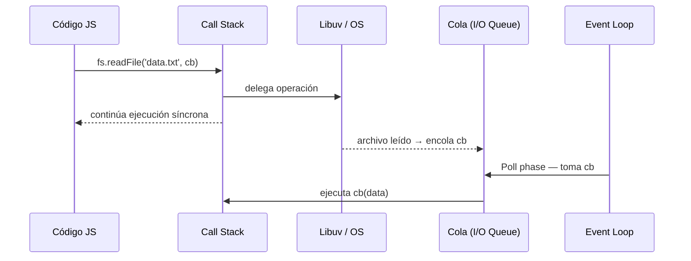
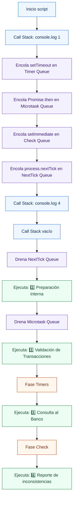
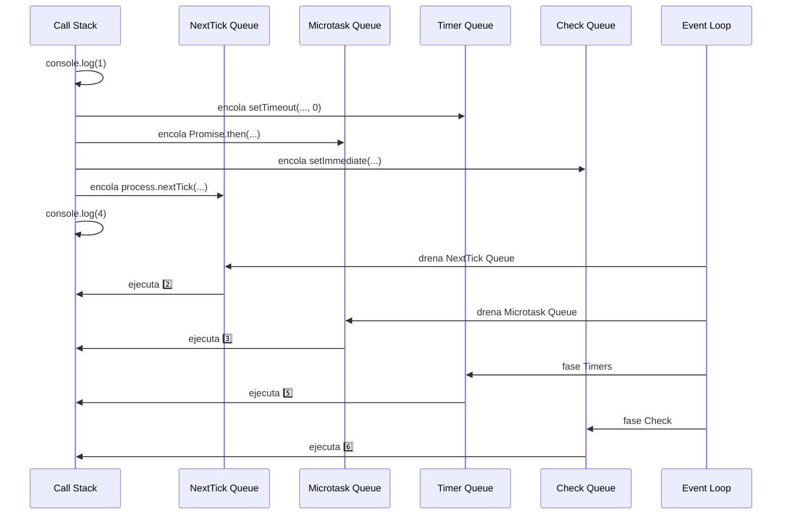

# 01-Event-Loop - Node.js Learning Path

Proyecto educativo sobre el Event Loop de Node.js, Worker Threads, y conceptos avanzados de concurrencia.

## 📚 Estructura del Proyecto

El proyecto está organizado por niveles progresivos de dificultad en la carpeta `src/`. Comienza en **Beginner** para entender los fundamentos y avanza hacia técnicas más avanzadas.

```
src/
├── beginner/          → Fundamentos del Event Loop
│   ├── calculation.ts
├── intermediate/      → Worker Threads y concurrencia
│   ├── calculation-worker.ts
│   └── cpu-worker.ts
└── advanced/          → Simulaciones y optimizaciones
    └── simulation.ts
```

### 🟢 Beginner - Fundamentos del Event Loop
**Objetivo**: Entender cómo funciona el Event Loop y por qué es importante no bloquear el hilo principal.

- **calculation.ts**: Compara dos enfoques:
  - ❌ `heavyCPUCalculation()`: Bloquea el hilo principal (5 segundos de espera)
  - ✅ `heavyCPUCalculationNonBlocking()`: Divide el trabajo en chunks y cede el control con `setImmediate()`

**Lecciones clave**: Single-thread, Non-blocking, Event Loop phases, `setImmediate()`

### 🟡 Intermediate - Worker Threads
**Objetivo**: Aprender a usar Worker Threads para ejecutar cálculos pesados sin bloquear el hilo principal.

- **calculation-worker.ts**: Orquesta la creación y comunicación con un Worker Thread. Demuestra cómo el hilo principal se mantiene libre mientras el Worker procesa datos.
- **cpu-worker.ts**: El Worker que realiza el cálculo pesado en paralelo en un hilo separado.

**Lecciones clave**: Worker Threads, message passing, true parallelism para CPU-bound tasks

### 🔴 Advanced - Simulaciones Complejas
**Objetivo**: Aplicar conocimientos anteriores a escenarios del mundo real (procesamiento de grandes volúmenes de datos).

- **simulation.ts**: Procesa miles de datos en lotes usando `setImmediate()` sin bloquear el hilo principal. Demuestra cómo escalar operaciones sin sacrificar responsividad.

**Lecciones clave**: Batch processing, back-pressure management, optimización de aplicaciones Node.js

## 🚀 Cómo ejecutar

### Prerequisitos
```bash
npm install
```

### Ejecutar por nivel

**Beginner**
```bash
# Ver cálculos no-bloqueantes
npx ts-node src/beginner/calculation.ts
```

**Intermediate**
```bash
# Usar Worker Threads
npx ts-node src/intermediate/calculation-worker.ts
```

**Advanced**
```bash
# Simulación de procesamiento en lotes
npx ts-node src/advanced/simulation.ts
```

---

## ¿Qué es Event Loop?

Mecanismo interno de Node.js que gestiona la ejecución de código **asíncrono**, permitiendo operaciones **no bloqueantes (Non-Blocking)** en un único hilo de ejecución (**Single-Thread**).

- Las operaciones de I/O pesadas se delegan a **Libuv** (biblioteca en C que gestiona hilos del SO).
- Cuando la operación termina, su callback se encola para que el Event Loop lo procese.

---

## Arquitectura General

```
┌─────────────────────────────────────────────────┐
│                  Node.js Process                │
│                                                 │
│   Tu código JS   ──►  Call Stack                │
│                           │                     │
│                    ┌──────▼──────┐              │
│                    │ Event Loop  │              │
│                    └──────┬──────┘              │
│          ┌────────────────┼────────────────┐    │
│          ▼                ▼                ▼    │
│   Microtask Queue   Timer Queue      I/O Queue  │
│   (Promise, queueMicrotask)  (setTimeout)       │
│                                                 │
│              ┌──────────────┐                   │
│              │    Libuv     │  ← hilos del SO   │
│              └──────────────┘                   │
└─────────────────────────────────────────────────┘
```

---

## Conceptos Clave

| Concepto | Definición |
|---|---|
| **Single-Thread** | Node.js ejecuta JS en un solo hilo; no hay paralelismo en el código de usuario. |
| **Non-Blocking** | Las operaciones I/O no detienen el hilo principal; se delegan y se notifica al terminar. |
| **Libuv** | Biblioteca en C que provee el event loop real, manejo de I/O asíncrono y pool de hilos. |
| **Call Stack** | Pila LIFO donde se apilan y ejecutan las funciones síncronas. |
| **Microtask Queue** | Cola de alta prioridad. Vacía completamente **antes** de pasar a la siguiente fase. Contiene callbacks de `Promise.then`, `queueMicrotask` y `process.nextTick`. |
| **Timer Queue** | Callbacks de `setTimeout` y `setInterval` cuyo tiempo ya expiró. |
| **I/O Queue** | Callbacks de operaciones I/O completadas (fs, net, http…). |
| **Check Queue** | Callbacks de `setImmediate`. Se ejecutan al final del ciclo actual. |
| **Callback Queue** | Término genérico para el conjunto de colas que el Event Loop drena en cada iteración. |

> **`process.nextTick`** tiene prioridad sobre el resto de microtasks y se procesa al final de la operación actual, antes de continuar el loop.

---

## Fases del Event Loop

En cada iteración (**tick**) el Event Loop recorre estas fases en orden. Al **terminar cada fase** (o entre callbacks) vacía primero la **Microtask Queue**.

```mermaid
flowchart TD
     T1[1. Timers<br/>setTimeout / setInterval] --> M1[Microtasks]
     M1 --> T2[2. Pending Callbacks<br/>I/O diferidos del ciclo anterior]
     T2 --> M2[Microtasks]
     M2 --> T3[3. Idle / Prepare<br/>uso interno de Node.js]
     T3 --> M3[Microtasks]
     M3 --> T4[4. Poll<br/>espera y procesa I/O]
     T4 --> M4[Microtasks]
     M4 --> T5[5. Check<br/>setImmediate]
     T5 --> M5[Microtasks]
     M5 --> T6[6. Close Callbacks<br/>socket.on('close', ...)]
     T6 -. next tick .-> T1

     classDef phase fill:#fff7ed,stroke:#c2410c,stroke-width:1px,color:#7c2d12;
     classDef queue fill:#f4f1ff,stroke:#6f42c1,stroke-width:1px,color:#3d1b8a;

     class T1,T2,T3,T4,T5,T6 phase;
     class M1,M2,M3,M4,M5 queue;
```

### Descripción de cada fase

| # | Fase | Qué ejecuta |
|---|---|---|
| 1 | **Timers** | Callbacks de `setTimeout` / `setInterval` cuyo delay ya venció. |
| 2 | **Pending Callbacks** | Callbacks de I/O diferidos del ciclo anterior (ej.: errores TCP). |
| 3 | **Idle / Prepare** | Uso interno de Node.js; no relevante para el código de usuario. |
| 4 | **Poll** | Recupera eventos I/O nuevos y ejecuta sus callbacks. Si no hay nada, **espera** aquí. |
| 5 | **Check** | Ejecuta callbacks de `setImmediate`. |
| 6 | **Close Callbacks** | Cierre de recursos: `socket.destroy()`, `fs.close()`, etc. |

---

## Orden de Prioridad de las Colas

```
process.nextTick  ←  mayor prioridad
     │
     ▼
Promise.then / queueMicrotask  (Microtask Queue)
     │
     ▼
setTimeout / setInterval  (Timer Queue — fase 1)
     │
     ▼
I/O callbacks  (I/O Queue — fase 4)
     │
     ▼
setImmediate  (Check Queue — fase 5)
     │
     ▼
close callbacks  (Close Queue — fase 6)
```

---

## Flujo de un Callback Asíncrono



---

## Ejemplo Rápido

Este ejemplo corresponde al archivo [`main.ts`](./main.ts):

```ts
console.log("1️⃣ Inicio del Proceso de Conciliación Bancaria \\n");

setTimeout(() => {
  console.log("5️⃣ Consulta al Banco: Transacciones Obtenidas \\n");
}, 0);

Promise.resolve().then(() => {
  console.log("3️⃣ Validación de Transacciones: Completada \\n");
});

setImmediate(() => {
  console.log("6️⃣ Reporte de inconsistencias generado \\n");
});

process.nextTick(() => {
  console.log("2️⃣ Preparación interna antes de continuar \\n");
});

console.log("4️⃣ Esperando respuesta del banco... \\n");
```

Salida esperada:

```txt
1️⃣ Inicio del Proceso de Conciliación Bancaria
4️⃣ Esperando respuesta del banco...
2️⃣ Preparación interna antes de continuar
3️⃣ Validación de Transacciones: Completada
5️⃣ Consulta al Banco: Transacciones Obtenidas
6️⃣ Reporte de inconsistencias generado
```

### Visual — Encolado y ejecución en este ejemplo



### Visual — Timeline de ejecución (mismo ejemplo)



Orden efectivo de ejecución:

`1 → 4 → 2 → 3 → 5 → 6`

### ¿Por qué sale en ese orden?

1. Se ejecuta primero todo lo síncrono del script principal (`1` y `4`).
2. Antes de pasar a fases de timers/check, Node drena `process.nextTick` (`2`).
3. Luego drena el resto de microtasks (`Promise.then`) (`3`).
4. En la fase **Timers** se ejecuta `setTimeout(..., 0)` (`5`).
5. En la fase **Check** se ejecuta `setImmediate` (`6`).

---

## Errores frecuentes

### `Cannot find name 'process'`

Si TypeScript no reconoce APIs de Node (`process`, `setImmediate`, etc.), instala tipos de Node y decláralos en `tsconfig.json`:

```bash
npm i -D @types/node
```

```json
{
     "compilerOptions": {
          "types": ["node"]
     }
}
```

### "`setTimeout(..., 0)` debería ejecutarse primero"

No necesariamente. `0ms` no significa "inmediato", significa "elegible en la fase Timers". Antes de esa fase, Node puede drenar `nextTick` y microtasks.

---

## Checklist de aprendizaje

- Entiendo la diferencia entre **Call Stack** y **colas del Event Loop**.
- Sé que `process.nextTick` tiene prioridad sobre otras microtasks.
- Puedo justificar por qué `setImmediate` ocurre después de Timers en este ejemplo.
- Puedo predecir el orden de salida sin ejecutar el código.

---

## Experimentos guiados (sobre `main.ts`)

> Idea: realiza **un cambio por vez**, ejecuta `npm run start`, compara salida y restaura antes de pasar al siguiente.

### Experimento 1 — Agregar `queueMicrotask`

Agrega este bloque debajo del `Promise.resolve().then(...)`:

```ts
queueMicrotask(() => {
     console.log("🧪 Microtask explícita con queueMicrotask");
});
```

Hipótesis:

- Debe ejecutarse en la cola de microtasks (después de `nextTick`).
- Saldrá junto al bloque de microtasks, antes de `setTimeout` y `setImmediate`.

Qué validar:

- Que aparezca entre `2️⃣` y `5️⃣`.

### Experimento 2 — Encadenar `process.nextTick` dentro de una Promise

Reemplaza temporalmente el bloque de Promise por:

```ts
Promise.resolve().then(() => {
     console.log("3️⃣ Validación de Transacciones: Completada \n");

     process.nextTick(() => {
          console.log("🧪 nextTick programado desde Promise");
     });
});
```

Hipótesis:

- Primero corre el `nextTick` original (`2️⃣`).
- Luego corre la Promise (`3️⃣`).
- El `nextTick` nuevo se ejecuta justo después de ese callback, antes de timers/check.

Qué validar:

- Que el mensaje `🧪 nextTick programado desde Promise` salga antes de `5️⃣` y `6️⃣`.

### Experimento 3 — Simular I/O real con `fs.readFile`

Agrega al inicio:

```ts
const fs = require("node:fs");
```

Y luego, antes del `console.log("4️⃣...")`, agrega:

```ts
fs.readFile(__filename, "utf8", () => {
     console.log("🧪 I/O real: readFile completado");
});
```

Hipótesis:

- El callback de `readFile` entra por Poll (I/O), no por Timer.
- Dependiendo del ciclo en que complete, puede intercalarse distinto respecto a `setImmediate`.

Qué validar:

- Que `🧪 I/O real: readFile completado` no es microtask.
- Que su posición depende de cuándo termina el I/O real.

### Regla práctica que deberías confirmar

- En este ejemplo: síncrono → `nextTick` → microtasks → timers → check.
- El I/O real no sigue la Timer Queue; depende de Poll.

---

## Referencias

- [Node.js Docs — The Node.js Event Loop](https://nodejs.org/en/docs/guides/event-loop-timers-and-nexttick)
- [Libuv — Design overview](https://docs.libuv.org/en/v1.x/design.html)
