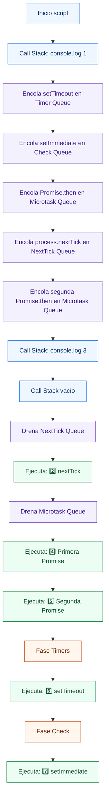
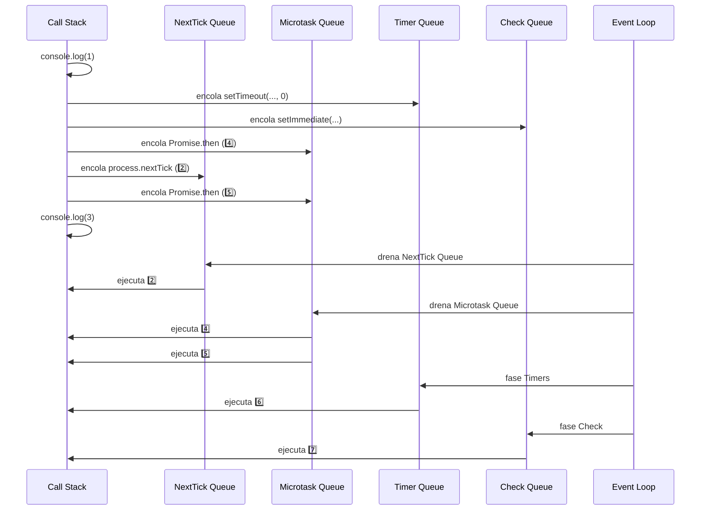

# 02-Microtasks vs Macrotasks - Node.js Learning Path

Proyecto educativo sobre la diferencia entre Microtasks y Macrotasks en Node.js, el orden de prioridad de ejecución, el concepto de **starvation** y el comportamiento del Event Loop ante distintos tipos de tareas asíncronas.

## 📚 Estructura del Proyecto

El proyecto está organizado por niveles progresivos de dificultad en la carpeta `src/`. Comienza en **Beginner** para entender las prioridades básicas y avanza hacia escenarios complejos reales.

```
src/
├── beginner/          → Prioridad de ejecución básica
│   └── priority-demo.ts
├── intermediate/      → Starvation y microtasks encadenadas
│   └── starvation.ts
└── advanced/          → I/O real + nextTick anidado + Promises + Timers
    └── mixed-async.ts
```

### 🟢 Beginner — Prioridad de ejecución
**Objetivo**: Visualizar el orden exacto en que Node.js ejecuta cada tipo de tarea.

- **priority-demo.ts**: Pone en cola un `setTimeout`, `setImmediate`, `Promise.then`, `queueMicrotask` y `process.nextTick` en el mismo script y muestra el orden real de ejecución.

**Lecciones clave**: NextTick Queue, Microtask Queue, Timer Queue, Check Queue, orden de prioridad

### 🟡 Intermediate — Starvation
**Objetivo**: Entender qué es la starvation y cómo las microtasks encadenadas pueden bloquear el Event Loop.

- **starvation.ts**: Demuestra el encadenamiento seguro de `Promise.then` (5 iteraciones) que retrasa las macrotasks, y documenta (comentado) cómo `process.nextTick` recursivo produce starvation real.

**Lecciones clave**: Starvation, microtask flooding, encadenamiento de Promises, back-pressure

### 🔴 Advanced — Mezcla compleja con I/O real
**Objetivo**: Predecir el orden de ejecución cuando conviven I/O real (`fs`), `nextTick` anidado, Promises encadenadas y macrotasks.

- **mixed-async.ts**: Usa `fs.readFile` real y anida `process.nextTick` y `setImmediate` dentro de callbacks de I/O. Reproduce el patrón que aparece en servidores Node.js reales.

**Lecciones clave**: Poll Queue, nextTick anidado, setImmediate desde I/O, orden garantizado dentro de callbacks

---

## 🚀 Cómo ejecutar

### Prerequisitos
```bash
# Desde la raíz del monorepo (node/)
npm install
```

### Ejecutar por nivel

**Main (demo original)**
```bash
npx ts-node main.ts
# o
npm run start:main
```

**Beginner**
```bash
npx ts-node src/beginner/priority-demo.ts
# o
npm run start:beginner
```

**Intermediate**
```bash
npx ts-node src/intermediate/starvation.ts
# o
npm run start:intermediate
```

**Advanced**
```bash
npx ts-node src/advanced/mixed-async.ts
# o
npm run start:advanced
```

---

## ¿Qué son las Microtasks?

Tareas que se ejecutan **después de que termina el Call Stack** y **antes de que el Event Loop pase a la siguiente fase**. Tienen mayor prioridad que cualquier macrotask.

| API | Cola |
|---|---|
| `process.nextTick()` | NextTick Queue (prioridad máxima) |
| `Promise.then()` | Microtask Queue |
| `queueMicrotask()` | Microtask Queue |

> **Regla crítica**: Después de cada fase del Event Loop, Node drena **completamente** la Microtask Queue antes de avanzar. Si generas microtasks infinitas → el loop nunca avanza → **STARVATION**.

---

## ¿Qué son las Macrotasks?

Tareas que entran en las **fases normales del Event Loop** y compiten entre sí según la fase en que se registran.

| API | Fase | Cola |
|---|---|---|
| `setTimeout()` | 1 — Timers | Timer Queue |
| `setInterval()` | 1 — Timers | Timer Queue |
| I/O callbacks (`fs`, `net`, `http`) | 4 — Poll | I/O Queue |
| `setImmediate()` | 5 — Check | Check Queue |
| `socket.on('close', ...)` | 6 — Close | Close Queue |

---

## Orden de Prioridad

```
process.nextTick  ←  mayor prioridad (NextTick Queue)
     │
     ▼
Promise.then / queueMicrotask  (Microtask Queue)
     │
     ▼
setTimeout / setInterval  (Timer Queue — fase 1)
     │
     ▼
I/O callbacks  (I/O Queue — fase 4)
     │
     ▼
setImmediate  (Check Queue — fase 5)
     │
     ▼
close callbacks  (Close Queue — fase 6)
```

---

## Arquitectura: Dónde vive cada cola

```
┌──────────────────────────────────────────────────────────────┐
│                       Node.js Process                        │
│                                                              │
│   Tu código JS  ──►  Call Stack                              │
│                           │                                  │
│              ┌────────────▼────────────┐                     │
│              │       Event Loop        │                     │
│              └────────────┬────────────┘                     │
│                           │                                  │
│   ┌───────────────────────┼────────────────────────────┐     │
│   │                       │                            │     │
│   ▼                       ▼                            ▼     │
│  NextTick Queue    Microtask Queue             Macro Queues  │
│  (process.nextTick) (Promise.then,        (Timer / I/O /     │
│                      queueMicrotask)       Check / Close)    │
│                                                              │
│              ┌──────────────────┐                            │
│              │      Libuv       │  ← I/O async, hilos OS    │
│              └──────────────────┘                            │
└──────────────────────────────────────────────────────────────┘
```

---

## Conceptos Clave

| Concepto | Definición |
|---|---|
| **Microtask** | Tarea que se ejecuta entre fases del Event Loop. Tiene prioridad sobre cualquier macrotask. |
| **Macrotask** | Tarea registrada en una fase concreta del Event Loop (timers, I/O, check…). |
| **NextTick Queue** | Cola especial que Node drena **antes** incluso de las microtasks. Contiene `process.nextTick`. |
| **Microtask Queue** | Cola de alta prioridad. Contiene `Promise.then` y `queueMicrotask`. Se vacía tras NextTick. |
| **Starvation** | Estado en que las macrotasks nunca se ejecutan porque la Microtask Queue nunca se vacía. |
| **Promise encadenada** | Cada `.then()` encola una nueva microtask. El loop no avanza hasta agotar toda la cadena. |
| **Poll phase** | Fase donde se esperan y procesan callbacks de I/O real. Si hay `setImmediate`, avanza a Check. |

---

## Fases del Event Loop y dónde se vacían las colas

```mermaid
flowchart TD
     T1[1. Timers<br/>setTimeout / setInterval] --> M1[NextTick + Microtasks]
     M1 --> T2[2. Pending Callbacks<br/>I/O diferidos del ciclo anterior]
     T2 --> M2[NextTick + Microtasks]
     M2 --> T3[3. Idle / Prepare<br/>uso interno de Node.js]
     T3 --> M3[NextTick + Microtasks]
     M3 --> T4[4. Poll<br/>espera y procesa I/O]
     T4 --> M4[NextTick + Microtasks]
     M4 --> T5[5. Check<br/>setImmediate]
     T5 --> M5[NextTick + Microtasks]
     M5 --> T6[6. Close Callbacks<br/>socket.on('close', ...)]
     T6 -. next tick .-> T1

     classDef phase fill:#fff7ed,stroke:#c2410c,stroke-width:1px,color:#7c2d12;
     classDef queue fill:#f4f1ff,stroke:#6f42c1,stroke-width:1px,color:#3d1b8a;

     class T1,T2,T3,T4,T5,T6 phase;
     class M1,M2,M3,M4,M5 queue;
```

> Después de **cada fase**, Node drena primero la **NextTick Queue** y luego la **Microtask Queue** antes de continuar.

---

## Ejemplo Rápido

Este ejemplo corresponde al archivo [`main.ts`](./main.ts):

```ts
console.log('1️⃣ Inicio conciliación bancaria (Sync)');

setTimeout(() => {
  console.log('6️⃣ setTimeout ejecutado (MACROTASK)');
}, 0);

setImmediate(() => {
  console.log('7️⃣ setImmediate ejecutado (MACROTASK)');
});

Promise.resolve().then(() => {
  console.log('4️⃣ Promise microtask ejecutada (MICROTASK)');
});

process.nextTick(() => {
  console.log('2️⃣ nextTick ejecutado (MICROTASK ESPECIAL)');
});

Promise.resolve().then(() => {
  console.log('5️⃣ Segunda microtask Promise (MICROTASK)');
});

console.log('3️⃣ Fin del script principal (Sync)');
```

Salida esperada:

```txt
1️⃣ Inicio conciliación bancaria
3️⃣ Fin del script principal
2️⃣ nextTick ejecutado
4️⃣ Promise microtask ejecutada
5️⃣ Segunda microtask Promise
6️⃣ setTimeout ejecutado
7️⃣ setImmediate ejecutado
```

### Visual — Encolado y ejecución



### Visual — Timeline de ejecución



Orden efectivo de ejecución: `1 → 3 → 2 → 4 → 5 → 6 → 7`

### ¿Por qué sale en ese orden?

1. Se ejecuta primero todo lo síncrono (`1` y `3`).
2. Node drena la `NextTick Queue` — `process.nextTick` (`2`).
3. Luego drena la `Microtask Queue` — ambas Promises (`4` y `5`).
4. Fase **Timers**: se ejecuta `setTimeout(..., 0)` (`6`).
5. Fase **Check**: se ejecuta `setImmediate` (`7`).

> ⚠️ **El orden de `setTimeout(0)` vs `setImmediate` en el top-level del script es NO determinístico.** Depende de cuándo el SO registra el timer. Puede salir `6 → 7` o `7 → 6`. Dentro de un callback de **I/O**, `setImmediate` **siempre** gana.

---

## Starvation — El riesgo silencioso

Si encolas microtasks infinitas, el Event Loop **nunca avanza** a las fases de macrotasks:

```ts
// ⚠️  NO ejecutar — bloquea el proceso indefinidamente
function infiniteStarvation(): void {
  process.nextTick(infiniteStarvation);
}
infiniteStarvation();

setTimeout(() => {
  console.log('Este mensaje NUNCA aparecerá');
}, 0);
```

Esto puede ocurrir accidentalmente en producción cuando:
- Se encadenan Promises en un loop sin condición de salida.
- Se usa `process.nextTick` recursivo para reintentos.
- Se procesan eventos WebSocket que generan nuevas microtasks sin límite.

Ver el ejemplo seguro en [`src/intermediate/starvation.ts`](./src/intermediate/starvation.ts).

---

## Errores frecuentes

### `Cannot find name 'process'` / `Cannot find name 'setImmediate'`

```bash
npm i -D @types/node  # desde el workspace raíz o el proyecto
```

```json
{
  "compilerOptions": {
    "types": ["node"]
  }
}
```

### `setTimeout(..., 0)` no sale antes que `setImmediate`

`0ms` no es "inmediato". Significa "elegible en la fase Timers". Antes de esa fase, Node puede drenar `nextTick` y microtasks. Por eso `setImmediate` puede aparecer antes o después de `setTimeout(0)` dependiendo del contexto.

> **Regla**: Dentro de un callback de **I/O**, `setImmediate` **siempre** se ejecuta antes de `setTimeout(0)`.

---

## Checklist de aprendizaje

- [ ] Puedo distinguir entre Microtask y Macrotask sin consultar la documentación.
- [ ] Sé que `process.nextTick` tiene prioridad sobre `Promise.then`.
- [ ] Puedo predecir el orden de salida de `main.ts` sin ejecutarlo.
- [ ] Entiendo qué es starvation y en qué situaciones puede ocurrir.
- [ ] Sé por qué `setImmediate` gana a `setTimeout(0)` dentro de callbacks de I/O.

---

## Experimentos guiados

> Realiza **un cambio por vez**, ejecuta, compara la salida y restaura antes del siguiente.

### Experimento 1 — `queueMicrotask` vs `Promise.then`

Agrega en `main.ts` debajo del segundo `Promise.resolve().then(...)`:

```ts
queueMicrotask(() => {
  console.log('🧪 queueMicrotask — ¿antes o después de Promise.then?');
});
```

**Hipótesis**: Debe aparecer junto al bloque de microtasks, entre los `Promise.then` si se registra entre ellos.

**Qué validar**: Que `queueMicrotask` comparte cola con `Promise.then`, no con `process.nextTick`.

---

### Experimento 2 — `process.nextTick` encadenado dentro de una Promise

Reemplaza el primer `Promise.resolve().then(...)` por:

```ts
Promise.resolve().then(() => {
  console.log('4️⃣ Promise microtask ejecutada (MICROTASK)');

  process.nextTick(() => {
    console.log('🧪 nextTick programado desde Promise');
  });
});
```

**Hipótesis**: El `nextTick` nuevo se ejecuta antes de la siguiente microtask (`5️⃣`) porque la NextTick Queue tiene prioridad.

**Qué validar**: Que `🧪 nextTick programado desde Promise` aparezca antes de `5️⃣`.

---

### Experimento 3 — `setImmediate` vs `setTimeout(0)` desde I/O

Crea un archivo temporal y usa `fs.readFile` desde `main.ts`:

```ts
const fs = require('node:fs');

fs.readFile(__filename, 'utf8', () => {
  setTimeout(() => console.log('🧪 setTimeout desde I/O'), 0);
  setImmediate(() => console.log('🧪 setImmediate desde I/O'));
});
```

**Hipótesis**: `setImmediate` siempre gana a `setTimeout(0)` dentro de un callback de I/O.

**Qué validar**: El orden garantizado `setImmediate` → `setTimeout` en este contexto.

---

### Experimento 4 — Starvation controlada (5 → 100 iteraciones)

En `src/intermediate/starvation.ts`, cambia `MAX_ITERATIONS` de `5` a `100`.

**Hipótesis**: El `setTimeout` seguirá llegando, pero **mucho más tarde** que sin la cadena.

**Qué validar**: Que las macrotasks esperan hasta que se agota completamente la cadena de microtasks.

---

## Referencias

- [Node.js Docs — The Node.js Event Loop, Timers, and process.nextTick()](https://nodejs.org/en/docs/guides/event-loop-timers-and-nexttick)
- [Node.js Docs — queueMicrotask](https://nodejs.org/api/globals.html#queuemicrotaskcallback)
- [HTML Spec — Microtask queue](https://html.spec.whatwg.org/multipage/webappapis.html#microtask-queue)
- [Libuv — Design overview](https://docs.libuv.org/en/v1.x/design.html)