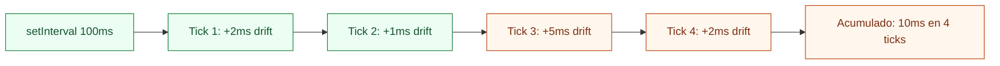
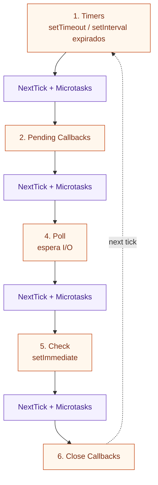

# 03-Timers - Node.js Learning Path

Proyecto educativo sobre los timers de Node.js: `setTimeout`, `setInterval`, `setImmediate`, su precisión real, el concepto de **drift**, y patrones avanzados de gestión de timers en producción.

## 📚 Estructura del Proyecto

El proyecto está organizado por niveles progresivos de dificultad en la carpeta `src/`. Comienza en **Beginner** para entender los fundamentos y avanza hacia patrones de producción.

```
src/
├── beginner/          → setTimeout, setImmediate y clearTimeout
│   └── timers-demo.ts
├── intermediate/      → setInterval, drift acumulado y self-correcting timer
│   └── intervals.ts
└── advanced/          → Timer pool, cancelación en cadena, graceful shutdown
    └── recursive-timeouts.ts
```

### 🟢 Beginner — setTimeout y setImmediate
**Objetivo**: Entender que los timers son una promesa de "no antes de X ms", no de "exactamente a los X ms".

- **timers-demo.ts**: Mide la desviación real de `setTimeout(0)` vs `setTimeout(50)`, demuestra `clearTimeout` y muestra el comportamiento no determinístico de `setImmediate` en top-level.

**Lecciones clave**: Timer Queue, Check Queue, delay mínimo real, clearTimeout

### 🟡 Intermediate — setInterval y drift
**Objetivo**: Comprender por qué `setInterval` acumula drift y cómo corregirlo.

- **intervals.ts**: Corre un interval de 100ms con trabajo interno de 20ms por tick, mide el drift tick a tick, y demuestra el patrón **self-correcting timer** con `setTimeout` recursivo que descuenta el drift en cada iteración.

**Lecciones clave**: Drift acumulado, setInterval vs setTimeout recursivo, clearInterval, self-correcting pattern

### 🔴 Advanced — Timer Pool y Graceful Shutdown
**Objetivo**: Implementar un scheduler de tareas cancelables con gestión de drift y shutdown limpio.

- **recursive-timeouts.ts**: Gestiona múltiples timers en un `Map<id, handle>`, mide drift acumulado por tarea, permite cancelación externa y demuestra `shutdownAll()` para evitar procesos zombie.

**Lecciones clave**: Timer pool, cancelación por id, graceful shutdown, rate limiting pattern

---

## 🚀 Cómo ejecutar

### Prerequisitos
```bash
# Desde la raíz del monorepo (node/)
npm install
```

### Ejecutar por nivel

**Main (demo original)**
```bash
npx ts-node main.ts
# o
npm run start:main
```

**Beginner**
```bash
npx ts-node src/beginner/timers-demo.ts
# o
npm run start:beginner
```

**Intermediate**
```bash
npx ts-node src/intermediate/intervals.ts
# o
npm run start:intermediate
```

**Advanced**
```bash
npx ts-node src/advanced/recursive-timeouts.ts
# o
npm run start:advanced
```

---

## ¿Qué son los Timers en Node.js?

Los timers no son parte del motor V8 — son provistos por **Libuv** a través del Event Loop. Internamente, Libuv mantiene un **min-heap de timers** ordenados por tiempo de expiración.

```
┌─────────────────────────────────────────────────────┐
│                   Libuv Timer Heap                  │
│                                                     │
│   [50ms]  [100ms]  [100ms]  [200ms]  [500ms]  ...   │
│      ↓                                              │
│   Event Loop fase Timers:                           │
│   → verifica cuáles expiraron (now >= expiry)       │
│   → los mueve a la cola de ejecución                │
│   → los ejecuta si el hilo está libre               │
└─────────────────────────────────────────────────────┘
```

**El delay es un mínimo, no una garantía.** Si el Event Loop está ocupado (procesando I/O, microtasks, etc.), el callback esperará hasta que esté libre.

---

## Los tres timers de Node.js

| API | Fase | Descripción |
|---|---|---|
| `setTimeout(fn, ms)` | 1 — Timers | Ejecuta `fn` una vez tras >= `ms` ms |
| `setInterval(fn, ms)` | 1 — Timers | Repite `fn` cada >= `ms` ms |
| `setImmediate(fn)` | 5 — Check | Ejecuta `fn` al final del ciclo actual, después de I/O |

---

## Precisión real: por qué los timers son imprecisos

```
Timeline real de setTimeout(fn, 100):

t=0ms    Script registra el timer
t=100ms  Timer EXPIRA (elegible para ejecutarse)
         ↓
         Event Loop en Phase Timers:
         ¿Hay microtasks pendientes? → las drena primero
         ¿Hay I/O completado?        → lo procesa antes
         ¿Call Stack vacío?          → ejecuta fn
         ↓
t=103ms  fn() se ejecuta realmente  ←  drift = +3ms
```

**Factores que aumentan el drift:**
- Call Stack ocupado con código síncrono
- Cola de microtasks larga (Promises encadenadas)
- I/O intensivo en fase Poll
- Carga del sistema operativo

---

## setTimeout vs setImmediate — ¿cuál va primero?

### En top-level del script (NO determinístico)

```ts
setTimeout(() => console.log('timeout'), 0);
setImmediate(() => console.log('immediate'));
```

El orden depende de cuándo el OS registra el timer. Puede ser cualquiera de los dos.

### Dentro de un callback de I/O (SIEMPRE setImmediate primero)

```ts
fs.readFile('file.txt', () => {
  setTimeout(() => console.log('timeout'), 0);
  setImmediate(() => console.log('immediate'));
});

// Salida garantizada:
// immediate  ← siempre primero dentro de I/O
// timeout
```

Esto ocurre porque dentro de un callback de I/O ya estás en la fase Poll. El Event Loop avanza directamente a Check (setImmediate) antes de volver a Timers.

---

## setTimeout vs setInterval — ¿cuándo usar cada uno?

```
setInterval(fn, 100)            setTimeout recursivo
─────────────────────           ────────────────────────────────
t=0    registra timer           t=0    registra timer
t=100  fn() ejecuta             t=100  fn() ejecuta
       [fn tarda 30ms]                 [fn tarda 30ms]
t=100  encola siguiente         t=130  encola siguiente desde aquí
t=200  siguiente tick           t=230  siguiente tick (auto-ajustado)
       [posible solapamiento]          sin solapamiento posible
```

**Usa `setInterval` cuando** la frecuencia exacta importa más que el solapamiento.

**Usa `setTimeout` recursivo cuando** no puedes permitir solapamiento (llamadas a APIs externas, escrituras a disco).

---

## Drift: el problema silencioso de setInterval



El patrón **self-correcting** mide el drift real y ajusta el siguiente delay:

```ts
function selfCorrectingTimer(targetMs: number, lastRun: number): void {
  const drift  = (Date.now() - lastRun) - targetMs;
  const nextMs = Math.max(0, targetMs - drift);
  setTimeout(() => selfCorrectingTimer(targetMs, Date.now()), nextMs);
}
```

---

## clearTimeout y clearInterval

```ts
const timer    = setTimeout(fn, 1000);
const interval = setInterval(fn, 500);

// Cancela antes de que dispare — no lanza error si ya disparó
clearTimeout(timer);
clearInterval(interval);
```

**Buenas prácticas:**
- Guarda siempre el handle: `const t = setTimeout(...)`
- Llama a `clearTimeout`/`clearInterval` en shutdown del proceso
- En servidores, mantén un `Set<NodeJS.Timeout>` para cancelar todos al recibir `SIGTERM`

---

## Graceful Shutdown

En servidores Node.js, los timers activos mantienen el proceso vivo. Si no los cancelas, el proceso no termina aunque hayas llamado a `server.close()`.

```ts
const activeTimers = new Set<ReturnType<typeof setTimeout>>();

function safeTimeout(fn: () => void, ms: number) {
  const handle = setTimeout(() => {
    activeTimers.delete(handle);
    fn();
  }, ms);
  activeTimers.add(handle);
  return handle;
}

process.on('SIGTERM', () => {
  for (const t of activeTimers) clearTimeout(t);
  process.exit(0);
});
```

Ver el patrón completo en [`src/advanced/recursive-timeouts.ts`](./src/advanced/recursive-timeouts.ts).

---

## Fases del Event Loop relevantes para Timers



> Los timers que expiran mientras el Event Loop está en fase **Poll** (esperando I/O) harán que el loop abandone Poll y vuelva a Timers.

---

## Ejemplo rápido — main.ts

Este ejemplo corresponde al archivo [`main.ts`](./main.ts):

```ts
const delay = 1000;
const start = Date.now();

setTimeout(() => {
  const end = Date.now();
  console.log(`Esperado: ${delay}ms`);
  console.log(`Real: ${end - start}ms`);  // Típicamente 1001-1003ms
}, delay);
```

Salida esperada:

```txt
Esperado: 1000ms
Real: 1001ms
```

---

## Conceptos Clave

| Concepto | Definición |
|---|---|
| **Timer Queue** | Cola de la fase 1. Contiene callbacks de `setTimeout`/`setInterval` cuyo delay ya venció. |
| **Check Queue** | Cola de la fase 5. Contiene callbacks de `setImmediate`. |
| **Min-heap** | Estructura de datos interna de Libuv para ordenar timers por tiempo de expiración. |
| **Drift** | Diferencia entre el delay solicitado y el tiempo real transcurrido. |
| **Drift acumulado** | Suma de drifts tick a tick en un interval. Crece con la carga del loop. |
| **Self-correcting timer** | Patrón `setTimeout` recursivo que descuenta el drift en cada iteración. |
| **Timer pool** | `Map<id, handle>` para gestionar y cancelar timers de forma nombrada. |
| **Graceful shutdown** | Cancelar todos los timers activos antes de terminar el proceso. |

---

## Checklist de aprendizaje

- [ ] Entiendo que `setTimeout(fn, 0)` no significa "inmediato".
- [ ] Sé por qué `setImmediate` gana a `setTimeout(0)` dentro de callbacks de I/O.
- [ ] Puedo explicar qué es el drift y por qué ocurre en `setInterval`.
- [ ] Conozco el patrón self-correcting timer y sé cuándo usarlo.
- [ ] Puedo implementar un timer pool cancelable.
- [ ] Sé qué pasa si no cancelo los timers activos al hacer shutdown.

---

## Experimentos guiados

> Realiza **un cambio por vez**, ejecuta, compara y restaura.

### Experimento 1 — Medir drift con Event Loop ocupado

En `src/beginner/timers-demo.ts`, agrega un bloqueo síncrono de 30ms antes del `setTimeout(50ms)`:

```ts
const blockUntil = Date.now() + 30;
while (Date.now() < blockUntil) { /* bloqueo intencional */ }
```

**Hipótesis**: El `setTimeout(50ms)` reportará ~80ms porque el loop estuvo bloqueado 30ms.

**Qué validar**: Que el drift aumenta proporcionalmente al tiempo bloqueado.

---

### Experimento 2 — setInterval con callback más lento que el interval

En `src/intermediate/intervals.ts`, cambia el bloqueo interno a `160ms` (mayor que el interval de `100ms`):

```ts
const busyUntil = Date.now() + 160;
```

**Hipótesis**: Cada tick tardará ~160ms en vez de ~100ms porque el callback bloquea más que el interval.

**Qué validar**: Que el drift acumulado crece muy rápido cuando el trabajo supera el interval.

---

### Experimento 3 — Cancelar una tarea antes de que empiece

En `src/advanced/recursive-timeouts.ts`, cancela `'medium'` inmediatamente después de registrarla:

```ts
schedule('medium', 120, 4);
cancel('medium');  // cancelación inmediata
```

**Hipótesis**: `'medium'` nunca ejecutará ningún tick.

**Qué validar**: Que `clearTimeout` en el primer handle previene la primera ejecución.

---

## Referencias

- [Node.js Docs — Timers](https://nodejs.org/en/docs/guides/timers-in-node)
- [Node.js Docs — setImmediate vs setTimeout](https://nodejs.org/en/docs/guides/event-loop-timers-and-nexttick#setimmediate-vs-settimeout)
- [Libuv — Timer design](https://docs.libuv.org/en/v1.x/timer.html)