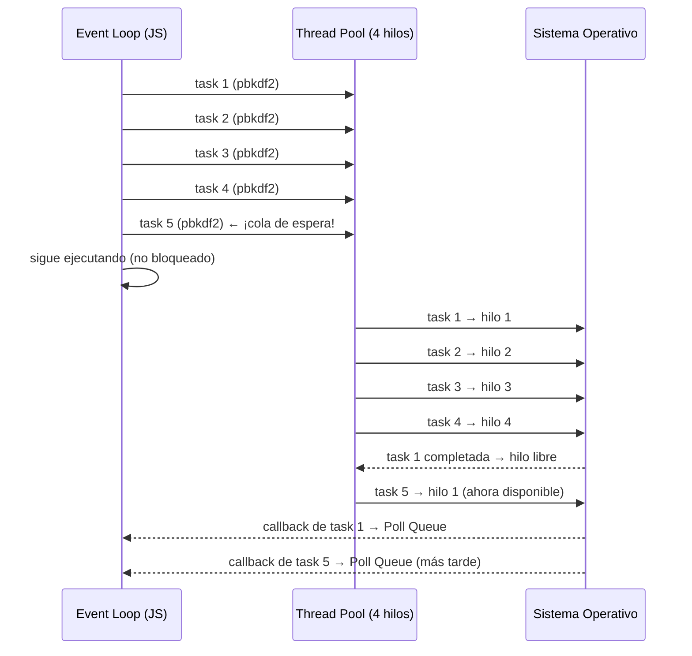
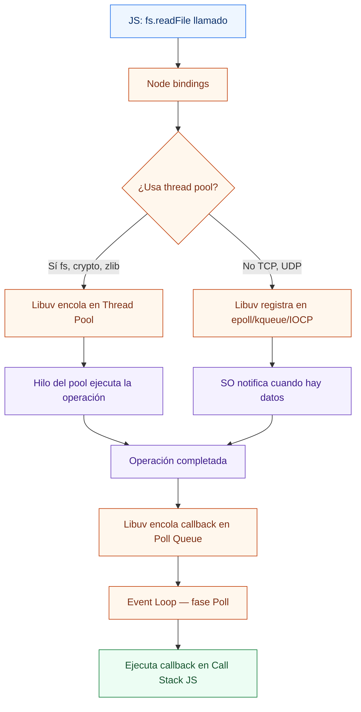
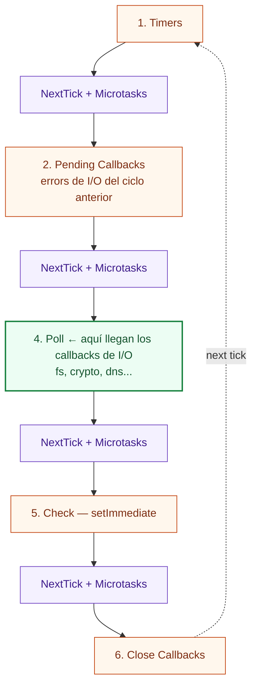

# 04-Libuv I/O - Node.js Learning Path

Proyecto educativo sobre cómo Libuv gestiona las operaciones de I/O en Node.js: el thread pool, la diferencia entre I/O bloqueante y no bloqueante, qué operaciones usan el pool vs el SO directamente, y patrones de I/O concurrente en producción.

## 📚 Estructura del Proyecto

El proyecto está organizado por niveles progresivos de dificultad en la carpeta `src/`. Comienza en **Beginner** para entender la diferencia fundamental bloqueante/no-bloqueante y avanza hacia patrones de concurrencia real.

```
src/
├── beginner/          → readFileSync vs readFile: bloqueante vs no-bloqueante
│   └── io-basics.ts
├── intermediate/      → Thread pool, saturación y UV_THREADPOOL_SIZE
│   └── io-threads.ts
└── advanced/          → I/O concurrente, streams y DNS lookup
    └── io-uv-loop.ts
```

### 🟢 Beginner — I/O bloqueante vs no-bloqueante
**Objetivo**: Ver en la práctica por qué nunca se debe usar *Sync en el hilo principal de un servidor.

- **io-basics.ts**: Compara `fs.readFileSync` (bloquea el Call Stack hasta que termina) con `fs.readFile` (devuelve el control inmediatamente y entrega el resultado por Poll Queue).

**Lecciones clave**: readFileSync vs readFile, Poll Queue, por qué no usar *Sync en servidores

### 🟡 Intermediate — Thread Pool y saturación
**Objetivo**: Entender que Libuv tiene exactamente 4 hilos por defecto y qué pasa cuando los superas.

- **io-threads.ts**: Lanza 5 operaciones `pbkdf2` simultáneas. Las primeras 4 arrancan de inmediato (un hilo cada una); la 5ª espera en cola hasta que un hilo queda libre. Demuestra el efecto de `UV_THREADPOOL_SIZE`.

**Lecciones clave**: Thread pool, UV_THREADPOOL_SIZE, saturación del pool, CPU-bound vs I/O-bound

### 🔴 Advanced — I/O concurrente, Streams y DNS
**Objetivo**: Aplicar los conceptos anteriores a patrones reales de producción.

- **io-uv-loop.ts**: Tres demos — lecturas concurrentes con `Promise.all` que van en paralelo al thread pool, streams con backpressure para archivos grandes, y DNS lookups con `dns.lookup` (thread pool) vs `dns.resolve` (async del SO).

**Lecciones clave**: Promise.all para I/O, streams vs readFile, dns.lookup vs dns.resolve, backpressure

---

## 🚀 Cómo ejecutar

### Prerequisitos
```bash
# Desde la raíz del monorepo (node/)
npm install
```

### Ejecutar por nivel

**Main (demo original — thread pool con pbkdf2)**
```bash
npm run start:main
```

**Beginner**
```bash
npm run start:beginner
```

**Intermediate**
```bash
npm run start:intermediate
```

**Intermediate con pool distinto**
```bash
UV_THREADPOOL_SIZE=1 npm run start:intermediate   # serie
UV_THREADPOOL_SIZE=5 npm run start:intermediate   # todo en paralelo
```

**Advanced**
```bash
npm run start:advanced
```

---

## ¿Qué es Libuv?

Libuv es la biblioteca en C que da a Node.js sus capacidades asíncronas. V8 sólo ejecuta JavaScript; Libuv maneja todo lo demás.

```
┌──────────────────────────────────────────────────────────┐
│                      Node.js Process                     │
│                                                          │
│   JavaScript (V8)                                        │
│      ↓                                                   │
│   Node.js Bindings  ──────────────────────►  Libuv       │
│                                               │          │
│                          ┌────────────────────┤          │
│                          │                    │          │
│                    Thread Pool           Event Loop      │
│                    (4 hilos)             (epoll/kqueue    │
│                          │               /IOCP)          │
│              ┌───────────┤                    │          │
│              │           │                    │          │
│           fs/crypto    DNS lookup         TCP/UDP/pipes   │
│           zlib         (getaddrinfo)      (async del SO) │
└──────────────────────────────────────────────────────────┘
```

---

## I/O bloqueante vs no-bloqueante

```
BLOQUEANTE (readFileSync):                NO BLOQUEANTE (readFile):

Call Stack:                               Call Stack:
  main()                                    main()
    readFileSync()  ← BLOQUEA                 readFile()   ← regresa YA
      [espera al disco]                       console.log  ← sigue
      [espera al disco]                    (vacío)
    console.log     ← recién ahora
                                          Libuv en background:
                                            [lee el disco]
                                          Poll Queue:
                                            callback(data) ← llega aquí
```

**Regla**: Nunca uses `*Sync` en el hilo principal de un servidor bajo carga. Un solo `readFileSync` bloquea todas las peticiones entrantes.

---

## El Thread Pool de Libuv

Node.js es **single-threaded para JavaScript**, pero **multi-threaded para I/O delegada** gracias al thread pool de Libuv.

```
┌────────────────────────────────────────────────────────┐
│                   Libuv Thread Pool                    │
│                                                        │
│   Hilo 1  [pbkdf2 task A]   ← ocupado                 │
│   Hilo 2  [fs.readFile B]   ← ocupado                 │
│   Hilo 3  [zlib.gzip C]     ← ocupado                 │
│   Hilo 4  [dns.lookup D]    ← ocupado                 │
│                                                        │
│   Cola de espera:  [pbkdf2 E]  ← esperando hilo libre │
└────────────────────────────────────────────────────────┘
```

Por defecto hay **4 hilos**. Cuando los 4 están ocupados, la siguiente tarea espera en cola → **latencia visible**.

### Cambiar el tamaño del pool

```bash
UV_THREADPOOL_SIZE=8 node server.js   # 8 hilos
UV_THREADPOOL_SIZE=1 node server.js   # 1 hilo (todo en serie)
```

Máximo permitido: **1024 hilos** (limitado por el SO en la práctica).

---

## ¿Qué usa el Thread Pool? ¿Qué no?

| Operación | Mecanismo | ¿Usa Thread Pool? |
|---|---|---|
| `fs.readFile` | Thread pool | ✅ Sí |
| `fs.writeFile` | Thread pool | ✅ Sí |
| `crypto.pbkdf2` | Thread pool | ✅ Sí |
| `zlib.gzip` | Thread pool | ✅ Sí |
| `dns.lookup` | Thread pool (getaddrinfo) | ✅ Sí |
| TCP/HTTP requests | Async del SO (epoll/kqueue) | ❌ No |
| UDP sockets | Async del SO | ❌ No |
| `dns.resolve` | Async del SO | ❌ No |
| Pipes / TTY | Async del SO | ❌ No |

> **Consecuencia**: hacer 100 `dns.lookup` simultáneos puede saturar el pool. Usa `dns.resolve` para lookups masivos.

---

## Saturación del Thread Pool



---

## Flujo completo de una operación I/O



---

## Fases del Event Loop: dónde llegan los callbacks de I/O



> Los callbacks de `fs.readFile`, `crypto.pbkdf2`, etc. llegan a la **fase Poll**. Si hay `setImmediate` programado, Node avanza de Poll a Check sin esperar más I/O.

---

## Streams vs readFile: memoria y backpressure

```
readFile (todo de una vez):              Stream (chunk a chunk):

Disco ──► buffer completo en RAM         Disco ──► chunk 1 ──► procesa
          [100MB en memoria]                      ──► chunk 2 ──► procesa
          ──► procesa                             ──► chunk 3 ──► procesa
                                                  [máx 64KB en memoria]
```

**Usa `readFile` cuando**: el archivo es pequeño (< 1MB) y necesitas todo el contenido.

**Usa streams cuando**: el archivo es grande, estás haciendo pipe a otro destino (HTTP response, fichero de salida), o necesitas controlar el consumo de memoria.

---

## Ejemplo rápido — main.ts

Este ejemplo corresponde al archivo [`main.ts`](./main.ts):

```ts
import { pbkdf2 } from 'crypto';

const start = Date.now();

function runCryptoTask(id: number) {
  pbkdf2('password', 'salt', 100000, 512, 'sha512', () => {
    console.log(`Task ${id} terminada en ${Date.now() - start}ms`);
  });
}

// 4 tareas → 4 hilos del pool → terminan casi al mismo tiempo
for (let i = 1; i <= 4; i++) {
  runCryptoTask(i);
}
```

Salida típica:

```txt
Task 2 terminada en 312ms
Task 1 terminada en 318ms
Task 3 terminada en 320ms
Task 4 terminada en 325ms
```

Todas terminan juntas porque cada una ocupa un hilo del pool en paralelo.

---

## Conceptos Clave

| Concepto | Definición |
|---|---|
| **Libuv** | Biblioteca en C que provee el Event Loop, thread pool y bindings de I/O a Node.js. |
| **Thread Pool** | Pool de 4 hilos (por defecto) que ejecuta operaciones bloqueantes del SO sin bloquear el Event Loop. |
| **UV_THREADPOOL_SIZE** | Variable de entorno para cambiar el tamaño del pool (1–1024). |
| **Saturación** | Estado en que todos los hilos del pool están ocupados y las nuevas tareas esperan en cola. |
| **Poll Queue** | Fase 4 del Event Loop donde llegan los callbacks de I/O completado. |
| **I/O-bound** | Tarea que pasa la mayor parte del tiempo esperando disco/red (fs, http). |
| **CPU-bound** | Tarea que usa intensamente el procesador (crypto, zlib, compresión). |
| **Backpressure** | Mecanismo de streams para pausar la producción de datos cuando el consumidor no puede seguir el ritmo. |
| **dns.lookup vs dns.resolve** | `lookup` usa getaddrinfo (thread pool). `resolve` usa async del SO directamente. |

---

## Checklist de aprendizaje

- [ ] Entiendo por qué no se debe usar `readFileSync` en un servidor.
- [ ] Sé que el thread pool tiene 4 hilos por defecto y cómo cambiarlo.
- [ ] Puedo predecir cuándo una tarea esperará en cola del thread pool.
- [ ] Entiendo la diferencia entre `dns.lookup` y `dns.resolve`.
- [ ] Sé cuándo usar `readFile` vs streams.
- [ ] Puedo explicar qué operaciones usan el thread pool vs el SO directamente.

---

## Experimentos guiados

> Realiza **un cambio por vez**, ejecuta, compara y restaura.

### Experimento 1 — Confirmar el bloqueo de readFileSync

En `src/beginner/io-basics.ts`, registra un `setTimeout` de 0ms ANTES del loop bloqueante y no lo canceles:

```ts
setTimeout(() => console.log('🧪 setTimeout 0ms — ¿cuándo sale?'), 0);
const blockUntil = Date.now() + 50;
while (Date.now() < blockUntil) { /* bloqueo */ }
```

**Hipótesis**: El setTimeout no puede disparar durante el bloqueo. Saldrá 50ms después.

**Qué validar**: Que el Event Loop no procesa ninguna cola mientras el Call Stack está ocupado.

---

### Experimento 2 — Saturar el thread pool

En `src/intermediate/io-threads.ts`, cambia `TASKS` de 5 a 8 y `ITERATIONS` a 200_000:

```ts
const ITERATIONS = 200_000;
const TASKS      = 8;
```

**Hipótesis**: Las tareas 1-4 terminan juntas (~600ms), las tareas 5-8 terminan en el segundo lote (~1200ms).

**Qué validar**: Que el tiempo del segundo lote es ~2x el del primero.

---

### Experimento 3 — dns.resolve vs dns.lookup

En `src/advanced/io-uv-loop.ts`, reemplaza `dns.lookup` por `dns.resolve`:

```ts
import { promisify } from 'node:util';
const dnsResolve = promisify(dns.resolve);
// ...
const result = await dnsResolve(host);
```

**Hipótesis**: `dns.resolve` puede ser más rápido bajo carga porque no usa el thread pool.

**Qué validar**: Que los tiempos de resolución son similares o menores con `resolve` para 3 hosts.

---

## Referencias

- [Node.js Docs — The Node.js Event Loop](https://nodejs.org/en/docs/guides/event-loop-timers-and-nexttick)
- [Libuv — Design overview](https://docs.libuv.org/en/v1.x/design.html)
- [Libuv — Thread pool](https://docs.libuv.org/en/v1.x/threadpool.html)
- [Node.js Docs — dns.lookup vs dns.resolve](https://nodejs.org/api/dns.html#dnslookuphostname-options-callback)