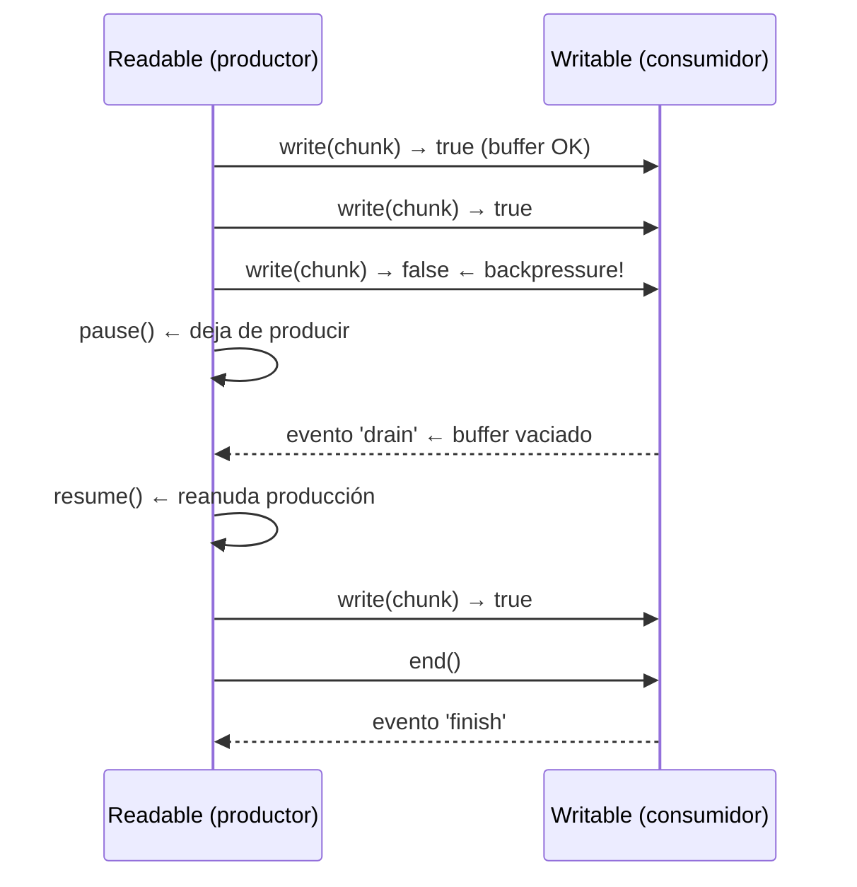
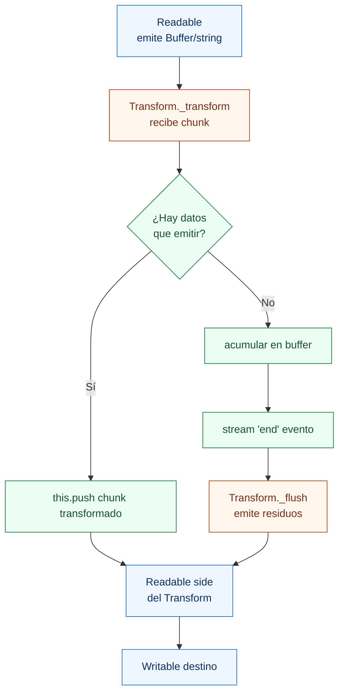
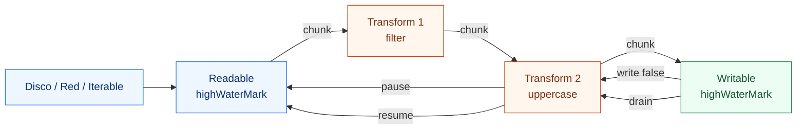

# 05-Streams & Backpressure - Node.js Learning Path

Proyecto educativo sobre Streams en Node.js: qué son, cómo procesan datos chunk a chunk, qué es el backpressure, cómo responder con `pause()`/`resume()`, por qué usar `pipeline()` en producción, y cómo construir Transform streams personalizados.

## 📚 Estructura del Proyecto

El proyecto está organizado por niveles progresivos en la carpeta `src/`. Empieza por **Beginner** para ver la diferencia fundamental entre `readFile` y `createReadStream`, luego avanza al problema de backpressure, y termina construyendo Transform streams complejos.

```
src/
├── beginner/          → readFile vs createReadStream, los 4 tipos de streams
│   └── streams-basics.ts
├── intermediate/      → Backpressure: write() false, pause/resume, pipe vs pipeline
│   └── backpressure.ts
└── advanced/          → Custom Transform, Object Mode, pipelines encadenados
    └── transform-streams.ts
```

### 🟢 Beginner — Fundamentos de Streams
**Objetivo**: ver en la práctica por qué `readFile` es peligroso para archivos grandes y cómo un stream los procesa sin llenar la RAM.

- **streams-basics.ts**: compara `fs.readFile` (buffer completo en heap) vs `fs.createReadStream` con `highWaterMark: 64` (18 chunks de 64 bytes), crea un Readable desde un generador con `Readable.from()`, y lista los 4 tipos de stream.

**Lecciones clave**: Buffer completo vs chunks, highWaterMark, Readable.from(), 4 tipos de streams

### 🟡 Intermediate — Backpressure
**Objetivo**: entender qué ocurre cuando el productor va más rápido que el consumidor y cómo manejar la señal de backpressure.

- **backpressure.ts**: muestra que `write()` devuelve `false` cuando el buffer supera `highWaterMark`, demuestra `pause()`/`resume()` con el evento `drain`, y compara `.pipe()` (sin cleanup de errores) vs `pipeline()` (manejo completo).

**Lecciones clave**: `write() → false`, highWaterMark, pause/resume, drain event, pipeline vs pipe

### 🔴 Advanced — Transform Streams y Object Mode
**Objetivo**: construir Transform streams que reutilizan el patrón de pipeline con responsabilidad única y procesar objetos JS sin serializar.

- **transform-streams.ts**: implementa un CSV parser con `_transform()`/`_flush()` que ensambla chunks partidos, encadena 3 Transforms (FilterEmptyLines → ToUpperCase → AddTimestamp), usa Object Mode para un pipeline de usuarios JS, y construye un Readable custom con `_read()`.

**Lecciones clave**: `_transform()`, `_flush()`, Object Mode, `_read()`, pipeline multi-stage

---

## 🚀 Cómo ejecutar

### Prerequisitos
```bash
# Desde la raíz del monorepo (node/)
npm install
```

### Ejecutar por nivel

**Main (demo básico — Readable → Transform → Writable)**
```bash
npm run start:main
```

**Beginner**
```bash
npm run start:beginner
```

**Intermediate**
```bash
npm run start:intermediate
```

**Advanced**
```bash
npm run start:advanced
```

---

## ¿Qué es un Stream?

Un stream es un **flujo continuo de datos que se procesa por partes (chunks)**, sin cargar todo en memoria. Node.js los implementa como `EventEmitter` especializados.

```
Sin stream (readFile):                  Con stream (createReadStream):

Disco ──────────────►  Buffer (RAM)     Disco ──► chunk 1 ──► procesa ──► libera RAM
       [100 MB de golpe]                      ──► chunk 2 ──► procesa ──► libera RAM
       Procesa                                ──► chunk 3 ──► procesa ──► libera RAM
                                              [máx 64 KB en memoria en cualquier momento]
```

**Regla**: Nunca uses `readFile` para archivos de tamaño variable en un servidor. Un archivo de 2 GB intentará entrar en el heap → `HEAP OUT OF MEMORY`.

---

## Los 4 tipos de Streams

```
Stream (EventEmitter)
├─ Readable   → Solo se lee   (fs.createReadStream, http.IncomingMessage)
├─ Writable   → Solo se escribe (fs.createWriteStream, http.ServerResponse)
└─ Duplex     → Lee y escribe  (net.Socket — buffers independientes)
   └─ Transform → Duplex que transforma: entrada ≠ salida (zlib.createGzip, crypto)
```

| Tipo | Lee | Escribe | Ejemplo real |
|---|---|---|---|
| Readable | ✅ | ❌ | `fs.createReadStream`, `http.IncomingMessage` |
| Writable | ❌ | ✅ | `fs.createWriteStream`, `http.ServerResponse` |
| Duplex | ✅ | ✅ | `net.Socket`, WebSocket |
| Transform | ✅ | ✅ | `zlib.createGzip`, `crypto.createCipher` |

---

## ¿Qué es Backpressure?

Backpressure ocurre cuando el **productor genera datos más rápido de lo que el consumidor puede procesarlos**.

```
SIN control de backpressure:

  Disco (100 MB/s)                    BD (10 MB/s)
  ──────────────────►  [buffer RAM]  ──────────────►
                        ░░░░░░░░░░░
                        ████████████  ← crece sin límite
                        ████████████████████
                        CRASH: heap OOM
```

```
CON control de backpressure (pause/resume):

  Disco             pause()         resume()
  ──────►  chunk  ──────────────────────────►  BD
           write() → false ¿?       drain event
           (buffer lleno)           (buffer vaciado)
```

---

## highWaterMark

`highWaterMark` es el **límite del buffer interno** de un stream. No detiene el flujo automáticamente, sino que envía la señal:

- En un **Writable**: `write()` retorna `false` cuando hay más datos en buffer que `highWaterMark`.
- En un **Readable**: Node deja de llamar `_read()` cuando el buffer interno supera `highWaterMark`.

```ts
const stream = fs.createReadStream('file.txt', {
  highWaterMark: 64 * 1024,   // 64 KB por chunk (default: 16 KB)
});

const writable = new Writable({
  highWaterMark: 2,            // señal de backpressure a los 2 chunks
  write(chunk, _enc, cb) { cb(); }
});
```

---

## Backpressure: el patrón correcto



---

## .pipe() vs pipeline()

| | `.pipe()` | `pipeline()` |
|---|---|---|
| **Manejo de errores** | ❌ No propaga errores automáticamente | ✅ Propaga a callback/Promise |
| **Cleanup** | ❌ Si falla, el destino queda abierto | ✅ Cierra todos los streams |
| **Memory leaks** | ⚠️ Posibles si no manejas `error` | ✅ Sin leaks |
| **Producción** | ❌ No recomendado | ✅ Siempre usar |

```ts
// ❌ .pipe() — funciona pero peligroso
source.pipe(gzip).pipe(destination);   // si source falla, destination no se cierra

// ✅ pipeline() — siempre en producción
import { pipeline } from 'node:stream';
import { promisify } from 'node:util';
const pipelineAsync = promisify(pipeline);

await pipelineAsync(source, gzip, destination);
// si cualquier stream falla → todos se cierran correctamente
```

---

## Custom Transform Stream



**Casos de uso de `_flush()`**: cuando el Transform acumula datos (CSV parser, compresión, agregación) y queda un residuo al final del stream que también hay que emitir.

---

## Object Mode

Por defecto, los streams trabajan con `Buffer` o `string`. Con `objectMode: true` pueden emitir **cualquier objeto JavaScript**:

```ts
const enricher = new Transform({
  objectMode: true,   // entrada: objeto UserRecord → salida: objeto EnrichedRecord
  transform(user: UserRecord, _enc, cb) {
    const grade = user.score >= 90 ? 'A' : user.score >= 70 ? 'B' : 'C';
    this.push({ ...user, grade });
    cb();
  }
});
```

**Ventaja**: no necesitas serializar/deserializar objetos entre etapas del pipeline. Los objetos fluyen directamente con sus tipos TypeScript.

---

## Flujo completo: chunk a través de un pipeline



---

## Ejemplo rápido — main.ts

```ts
import { Readable, Writable, Transform, pipeline } from 'node:stream';
import { promisify } from 'node:util';

const pipelineAsync = promisify(pipeline);

// Readable desde iterable
const source = Readable.from(['Streams ', 'fluyen ', 'en ', 'chunks.\n']);

// Transform: convierte a mayúsculas
const upper = new Transform({
  transform(chunk, _enc, cb) { cb(null, chunk.toString().toUpperCase()); }
});

// Writable: imprime con etiqueta
const printer = new Writable({
  write(chunk, _enc, cb) {
    process.stdout.write(`[chunk] → ${chunk}`);
    cb();
  }
});

await pipelineAsync(source, upper, printer);
// [chunk] → STREAMS   [chunk] → FLUYEN   [chunk] → EN   [chunk] → CHUNKS.
```

---

## Conceptos Clave

| Concepto | Definición |
|---|---|
| **Stream** | Flujo de datos procesado por partes (chunks) sin cargar todo en RAM. |
| **Readable** | Stream del que sólo se puede leer. |
| **Writable** | Stream en el que sólo se puede escribir. |
| **Duplex** | Stream que implementa ambas interfaces (buffers independientes). |
| **Transform** | Duplex donde la salida es una transformación de la entrada. |
| **highWaterMark** | Umbral del buffer interno que activa la señal de backpressure. |
| **Backpressure** | Condición en que el productor supera la velocidad del consumidor. |
| **write() → false** | Señal de que el buffer interno está lleno; el productor debe pausarse. |
| **drain event** | El buffer se vació; el productor puede reanudar. |
| **pause() / resume()** | API manual para controlar el flujo de un Readable. |
| **pipeline()** | Encadena streams con propagación de errores y cleanup automático. |
| **Object Mode** | Permite emitir objetos JS arbitrarios en lugar de Buffers. |
| **_flush()** | Método de Transform llamado al final del stream para emitir residuos. |

---

## Checklist de aprendizaje

- [ ] Entiendo por qué `readFile` puede causar OOM con archivos grandes.
- [ ] Sé configurar `highWaterMark` y entiendo su efecto en el buffer.
- [ ] Puedo interpretar `write() → false` y sé qué hacer al recibirlo.
- [ ] Sé implementar `pause()` al escribir y `resume()` en el evento `drain`.
- [ ] Entiendo por qué `pipeline()` siempre debe usarse sobre `.pipe()`.
- [ ] Puedo construir un `Transform` con `_transform()` y `_flush()`.
- [ ] Entiendo cuándo usar `objectMode: true`.
- [ ] Puedo encadenar 3+ Transforms con `pipeline()`.

---

## Experimentos guiados

> Realiza **un cambio por vez**, ejecuta, compara y restaura.

### Experimento 1 — Tamaño del chunk

En `src/beginner/streams-basics.ts`, cambia `highWaterMark` de `64` a `512`:

```ts
const stream = fs.createReadStream(README_PATH, {
  highWaterMark: 512,   // era 64
  encoding: 'utf-8',
});
```

**Hipótesis**: El número de chunks baja (~2–3) pero los bytes totales son los mismos (~1145).

**Qué validar**: `highWaterMark` controla el tamaño del chunk, no los datos que se procesan.

---

### Experimento 2 — Ignorar backpressure

En `src/intermediate/backpressure.ts` Demo 2, elimina la lógica de `pause()`/`resume()`:

```ts
fastProducer.on('data', (chunk: Buffer) => {
  slowConsumer.write(chunk);     // ya no verificamos el retorno
  // sin pause() → todos los chunks se envían de golpe
});
```

**Hipótesis**: El Writable recibirá todos los chunks sin esperar, acumulando en su buffer interno.

**Qué validar**: Los "consumidos" impresos seguirán en orden, pero sin los eventos de `pause`/`drain`.

---

### Experimento 3 — Transform con error en _transform

En `src/advanced/transform-streams.ts`, haz que `ToUpperCase` falle al procesar "DATOS":

```ts
_transform(chunk: Buffer, _enc: string, cb: Function): void {
  const text = chunk.toString();
  if (text.includes('DATOS')) {
    // cb con un Error → pipeline lo capturará
    cb(new Error(`Chunk rechazado: "${text.trim()}"`));
    return;
  }
  this.push(text.toUpperCase());
  cb();
}
```

**Hipótesis**: `pipeline()` captura el error y detiene todos los streams del chain.

**Qué validar**: Que el `catch` del `pipelineAsync` recibe el error y el Writable final no sigue recibiendo chunks.

---

## Referencias

- [Node.js Docs — Stream](https://nodejs.org/api/stream.html)
- [Node.js Guide — Backpressure in Streams](https://nodejs.org/en/docs/guides/backpressuring-in-streams)
- [Node.js Docs — stream.pipeline](https://nodejs.org/api/stream.html#streampipelinesource-transforms-destination-callback)
- [Node.js Docs — Implementing a Transform](https://nodejs.org/api/stream.html#implementing-a-transform-stream)

