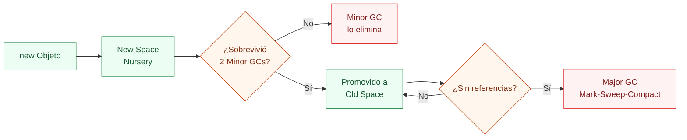
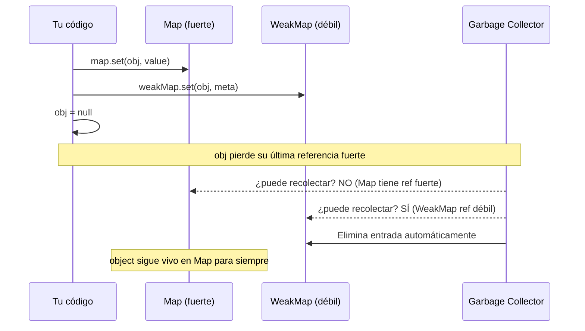
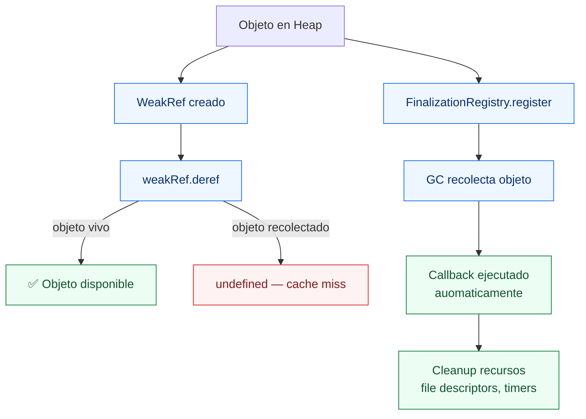

# 06-Memory, GC & V8 - Node.js Learning Path

Proyecto educativo sobre gestión de memoria en Node.js: la diferencia entre Stack y Heap, cómo V8 implementa el Garbage Collector generacional (New Space vs Old Space), cómo detectar y corregir fugas de memoria, y herramientas de profiling para producción.

## 📚 Estructura del Proyecto

El proyecto está organizado por niveles progresivos en la carpeta `src/`. Empieza en **Beginner** para entender dónde viven los datos y avanza hacia el GC generacional, fugas, WeakRef y monitoreo de producción.

```
src/
├── beginner/          → Stack vs Heap, copia por valor vs referencia, closures
│   └── heap-vs-stack.ts
├── intermediate/      → GC generacional, fugas de memoria, WeakMap, event listeners
│   └── gc-generations.ts
└── advanced/          → process.memoryUsage(), WeakRef, FinalizationRegistry, profiling
    └── memory-profiling.ts
```

### 🟢 Beginner — Stack vs Heap
**Objetivo**: ver en la práctica dónde vive cada tipo de dato y por qué los objetos se comparten por referencia.

- **heap-vs-stack.ts**: demuestra que primitivos se copian por valor (Stack) y objetos por referencia (Heap), shallow vs deep copy, y cómo una closure puede retener objetos grandes en el Heap.

**Lecciones clave**: Stack/Heap, copia por valor vs referencia, closure leaks, shallow/deep copy

### 🟡 Intermediate — GC Generacional y fugas de memoria
**Objetivo**: entender las dos generaciones del heap de V8, identificar los patrones de fuga más comunes y saber cómo prevenirlos.

- **gc-generations.ts**: compara objetos de vida corta vs larga (New Space vs Old Space), muestra una fuga con `Map` que acumula sin límite, contrasta `Map` vs `WeakMap`, y demuestra el event listener leak con `.on()`/`.once()`/`.off()`.

**Lecciones clave**: Minor GC, Major GC, Map leak, WeakMap, event listener leak, `.once()`

### 🔴 Advanced — Profiling y herramientas de diagnóstico
**Objetivo**: medir el heap en el tiempo, usar `WeakRef` para caches GC-friendly, registrar cleanup con `FinalizationRegistry`, y detectar fugas con snapshot trending.

- **memory-profiling.ts**: tabla de `process.memoryUsage()` antes/durante/después de asignaciones, `WeakCache` con `WeakRef`, `FinalizationRegistry` para cleanup de recursos, detector de tendencia creciente del heap, y flags de V8 para producción.

**Lecciones clave**: `process.memoryUsage()`, `WeakRef.deref()`, `FinalizationRegistry`, snapshot trending, `--max-old-space-size`

---

## 🚀 Cómo ejecutar

### Prerequisitos
```bash
# Desde la raíz del monorepo (node/)
npm install
```

### Ejecutar por nivel

**Main (demo básico — Stack, Heap y memoryUsage)**
```bash
npm run start:main
```

**Beginner**
```bash
npm run start:beginner
```

**Intermediate**
```bash
npm run start:intermediate
```

**Advanced**
```bash
npm run start:advanced
```

**Con diagnóstico de GC activado**
```bash
node --trace-gc -r ts-node/register src/intermediate/gc-generations.ts
```

---

## Stack vs Heap

Node.js (a través de V8) divide la memoria en dos zonas principales:

```
┌─────────────────────┐   ┌──────────────────────────────────────────┐
│       STACK         │   │                  HEAP                    │
│                     │   │                                          │
│  • Primitivos       │   │  • Objetos  { }                          │
│    number           │   │  • Arrays   [ ]                          │
│    string           │   │  • Funciones / closures                  │
│    boolean          │   │  • Buffers                               │
│    null/undefined   │   │                                          │
│    symbol/bigint    │   │  ┌──────────────┬─────────────────────┐  │
│                     │   │  │  New Space   │     Old Space        │  │
│  • Referencias      │   │  │  (Nursery)   │  (Tenured)          │  │
│    (punteros)       │   │  │  ~1–8 MB     │  ~cientos de MB     │  │
│                     │   │  └──────────────┴─────────────────────┘  │
│  Liberación: auto   │   │  Liberación: Garbage Collector           │
│  al salir del scope │   │                                          │
└─────────────────────┘   └──────────────────────────────────────────┘
```

---

## Copia por Valor vs Copia por Referencia

```
PRIMITIVOS (Stack) — copia por VALOR:       OBJETOS (Heap) — copia por REFERENCIA:

let a = 42;                                 const obj1 = { port: 3000 };
let b = a;   ← b recibe el VALOR 42        const obj2 = obj1;  ← b recibe PUNTERO
b = 99;                                     obj2.port = 9000;

a → [42]   (sin cambios)                    obj1.port → 9000  ← ¡también cambió!
b → [99]   (copia independiente)            obj2.port → 9000  ← mismo objeto en heap
```

**Copias de objetos:**

| Técnica | Código | Anidados |
|---|---|---|
| Shallow copy | `{ ...obj }` | ⚠️ Compartidos |
| Shallow copy | `Object.assign({}, obj)` | ⚠️ Compartidos |
| Deep copy | `JSON.parse(JSON.stringify(obj))` | ✅ Independientes |
| Deep copy | `structuredClone(obj)` (Node 17+) | ✅ Independientes |

---

## GC Generacional de V8

V8 implementa un **Generational Garbage Collector** basado en la hipótesis generacional: *la mayoría de los objetos mueren jóvenes*.

```
┌──────────────────────────────────────────────────────────────────┐
│                         V8 HEAP                                  │
│                                                                  │
│    New Space (Nursery)              Old Space (Tenured)          │
│    ┌─────────────────────┐         ┌───────────────────────┐    │
│    │  From-Space         │         │                       │    │
│    │  [obj A] [obj B]    │──copy──►│  [obj A] (promovido)  │    │
│    │  [obj C] [obj D]    │         │                       │    │
│    ├─────────────────────┤         └───────────────────────┘    │
│    │  To-Space (vacío)   │           ↑                          │
│    └─────────────────────┘           Promoción: sobrevive       │
│           │                          2 Minor GC cycles          │
│           ▼                                                      │
│    Minor GC (Scavenger):            Major GC (Mark-Sweep):       │
│    • Muy frecuente                  • Menos frecuente            │
│    • ~1ms                           • ~100ms+ ("stop-the-world") │
│    • Solo New Space                 • Todo el heap               │
└──────────────────────────────────────────────────────────────────┘
```

### Ciclo de vida de un objeto



---

## Fugas de Memoria — Patrones Comunes

### 1. Map que acumula sin límite

```ts
// ⚠️ LEAK: cache que nunca expira
const cache = new Map<string, object>();
app.on('request', (req) => {
  cache.set(req.userId, computeExpensiveData(req));
  // ← nunca se elimina → crece con cada request
});

// ✅ SOLUCIÓN: TTL o LRU
const MAX_SIZE = 1000;
if (cache.size > MAX_SIZE) {
  const oldestKey = cache.keys().next().value;
  cache.delete(oldestKey);
}
```

### 2. Event Listeners sin removeListener

```ts
// ⚠️ LEAK: listener registrado en cada request, nunca eliminado
server.on('request', (req) => {
  emitter.on('data', (data) => process(req, data));  // acumula indefinidamente
});

// ✅ SOLUCIÓN: .once() o guardar referencia para .off()
server.on('request', (req) => {
  const handler = (data: Buffer) => { process(req, data); };
  emitter.once('data', handler);      // auto-cleanup
  // o: req.on('close', () => emitter.off('data', handler));
});
```

### 3. Closures que capturan objetos grandes

```ts
// ⚠️ LEAK: bigData capturado por la closure aunque sólo necesites su longitud
function leak() {
  const bigData = new Array(1_000_000).fill('x');
  return () => bigData.length;   // bigData vive mientras la función exista
}

// ✅ SOLUCIÓN: capturar sólo lo necesario
function clean() {
  const bigData = new Array(1_000_000).fill('x');
  const len = bigData.length;   // copia el primitivo
  return () => len;             // bigData puede ser GC'd
}
```

---

## Map vs WeakMap vs WeakRef



| | `Map` | `WeakMap` | `WeakRef` |
|---|---|---|---|
| **Referencia** | Fuerte | Débil | Débil |
| **Previene GC** | ✅ Sí | ❌ No | ❌ No |
| **Iterable** | ✅ Sí | ❌ No | N/A |
| **Uso típico** | Cache permanente | Metadata de objetos | Cache opcional |
| **Leak risk** | ⚠️ Alto | ✅ Ninguno | ✅ Ninguno |

---

## process.memoryUsage()

```ts
const { rss, heapTotal, heapUsed, external, arrayBuffers } = process.memoryUsage();
```

| Campo | Qué mide |
|---|---|
| `rss` | Resident Set Size — toda la memoria del proceso en RAM |
| `heapTotal` | Tamaño total del heap reservado por V8 |
| `heapUsed` | Heap actualmente ocupado por objetos vivos |
| `external` | Memoria de objetos C++ vinculados (Buffers, streams) |
| `arrayBuffers` | `ArrayBuffer` y `SharedArrayBuffer` asignados |

**Patrón de detección de fuga**:

```ts
setInterval(() => {
  const { heapUsed, heapTotal } = process.memoryUsage();
  const ratio = heapUsed / heapTotal;

  if (ratio > 0.9) {
    logger.warn(`Heap usage ${(ratio * 100).toFixed(1)}% — posible fuga`);
  }
}, 10_000);
```

---

## WeakRef y FinalizationRegistry



- `WeakRef.deref()` → objeto si aún vive, `undefined` si fue GC'd
- `FinalizationRegistry` → callback *después* de que el objeto es recolectado (no garantiza cuándo)
- Ambos requieren `target: "es2022"` en tsconfig

---

## Flags de V8 para producción y diagnóstico

| Flag | Uso |
|---|---|
| `--max-old-space-size=4096` | Límite del Old Space en MB (default ~1.5 GB) |
| `--expose-gc` | Expone `global.gc()` para forzar GC en tests |
| `--inspect` | Abre DevTools — permite heap snapshots en Chrome |
| `--heap-prof` | Genera `.heapprofile` al terminar el proceso |
| `--trace-gc` | Imprime cada ciclo de GC con duración y tipo |
| `--trace-gc-verbose` | Traza detallada por generación |

```bash
# Limitar heap a 512 MB en producción
node --max-old-space-size=512 server.js

# Investigar leak con DevTools
node --inspect src/advanced/memory-profiling.ts
# → abre chrome://inspect → Memory tab → Take Heap Snapshot
```

---

## Conceptos Clave

| Concepto | Definición |
|---|---|
| **Stack** | Zona de memoria para primitivos y referencias; liberación automática al salir del scope. |
| **Heap** | Zona de memoria para objetos; liberada por el GC cuando no hay referencias. |
| **New Space** | Generación joven del heap (~1–8 MB). Minor GC muy rápido (~1ms). |
| **Old Space** | Generación tenured. Major GC más lento (~100ms). |
| **Minor GC** | Scavenger — colecta el New Space, muy frecuente. |
| **Major GC** | Mark-Sweep-Compact — colecta todo el heap, costoso. |
| **Promoción** | Cuando un objeto sobrevive 2 Minor GCs, se mueve al Old Space. |
| **WeakMap** | Map con referencias débiles — no previene la recolección de las claves. |
| **WeakRef** | Referencia débil a un objeto — `deref()` devuelve el objeto o `undefined`. |
| **FinalizationRegistry** | Callback ejecutado tras la recolección de un objeto registrado. |
| **Memory Leak** | Objeto que ya no se usa pero mantiene referencias que impiden su recolección. |
| **heapUsed** | Métrica principal de monitoreo — siempre creciente = posible leak. |

---

## Checklist de aprendizaje

- [ ] Entiendo la diferencia entre Stack y Heap.
- [ ] Sé por qué modificar `obj2` puede afectar `obj1`.
- [ ] Conozco la diferencia entre shallow copy y deep copy.
- [ ] Puedo explicar qué hace Minor GC vs Major GC.
- [ ] Sé identificar la fuga más común con `Map` sin TTL.
- [ ] Entiendo por qué `WeakMap` evita fugas de memoria.
- [ ] Puedo usar `process.memoryUsage()` para detectar tendencias.
- [ ] Sé para qué sirve `WeakRef.deref()` en un caché.
- [ ] Conozco al menos 3 flags de V8 para diagnóstico.

---

## Experimentos guiados

> Realiza **un cambio por vez**, ejecuta, compara y restaura.

### Experimento 1 — Confirmar que closures retienen memoria

En `src/beginner/heap-vs-stack.ts` Demo 3, registra snapshot antes y después de `createRetainer()`:

```ts
const before = process.memoryUsage().heapUsed;
const getLength = createRetainer();
const after = process.memoryUsage().heapUsed;
console.log(`Closure ocupa: +${((after - before) / 1024).toFixed(0)} KB`);
```

**Hipótesis**: La closure retiene ~800 KB del array hasta que `getLength` quede fuera de scope.

**Qué validar**: Que el heap crece al crear la closure y no se libera hasta que la variable se pierda.

---

### Experimento 2 — Simular saturación del Old Space

En `src/intermediate/gc-generations.ts`, sube `longLived` a 100.000 objetos y agrega un setInterval que imprime `heapUsed` cada 500ms:

```ts
setInterval(() => {
  console.log('heap:', (process.memoryUsage().heapUsed / 1e6).toFixed(1), 'MB');
}, 500);
```

**Hipótesis**: `heapUsed` crece sostenidamente mientras el array existe y baja (eventualmente) tras `length = 0`.

**Qué validar**: La diferencia entre el GC síncrono (no existe) y el GC asíncrono de V8.

---

### Experimento 3 — Forzar GC y medir impacto

Ejecuta el advanced con `--expose-gc`:

```bash
node --expose-gc -r ts-node/register src/advanced/memory-profiling.ts
```

Agrega en Demo 1, después de `objects.length = 0`:

```ts
if (typeof (global as any).gc === 'function') {
  (global as any).gc();
  console.log('GC forzado');
}
const afterForced = process.memoryUsage().heapUsed;
console.log(`Heap tras GC forzado: ${mb(afterForced)}`);
```

**Hipótesis**: El heap cae inmediatamente tras `global.gc()`, a diferencia del demo normal donde no baja.

**Qué validar**: Que el GC de V8 normalmente es lazy — sólo se activa cuando tiene presión o alcanza un umbral.

---

## Referencias

- [V8 — Memory Management](https://v8.dev/blog/trash-talk)
- [Node.js Docs — process.memoryUsage()](https://nodejs.org/api/process.html#processmemoryusage)
- [MDN — WeakRef](https://developer.mozilla.org/docs/Web/JavaScript/Reference/Global_Objects/WeakRef)
- [MDN — FinalizationRegistry](https://developer.mozilla.org/docs/Web/JavaScript/Reference/Global_Objects/FinalizationRegistry)
- [Node.js — Diagnostics: Heap Profiler](https://nodejs.org/en/docs/guides/diagnostics/memory/using-heap-profiler)
