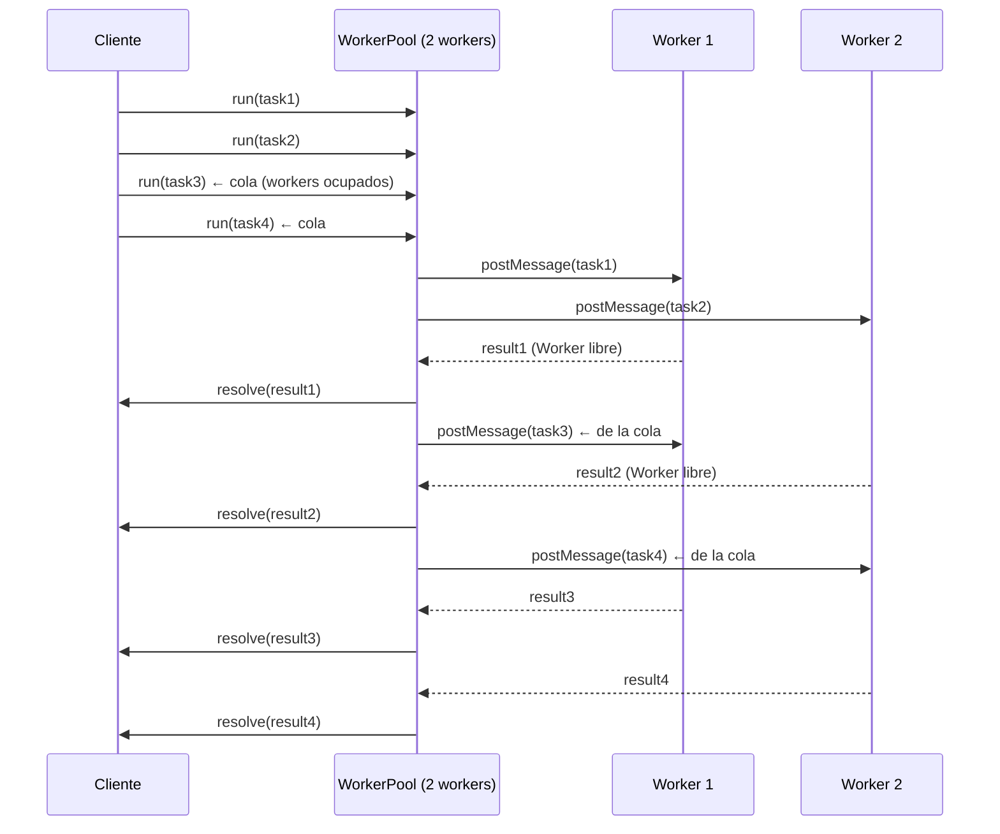
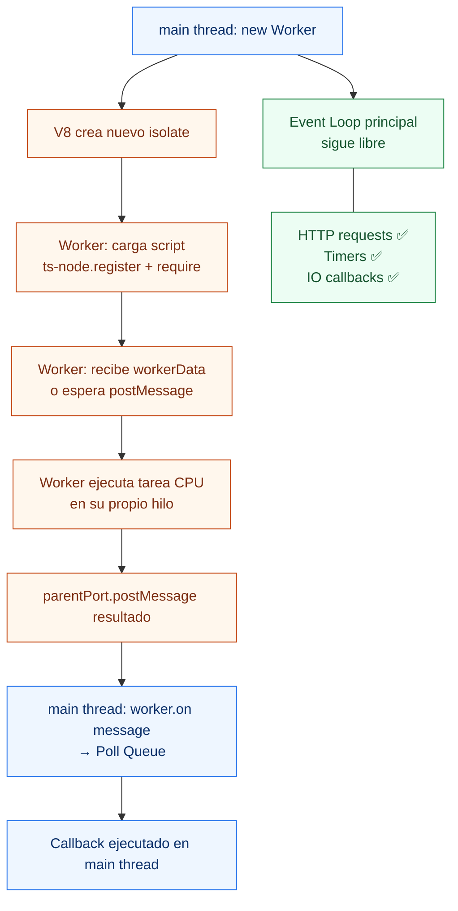

# 07-Worker Threads - Node.js Learning Path

Proyecto educativo sobre Worker Threads en Node.js: por qué las tareas CPU-bound bloquean el Event Loop, cómo delegar trabajo a hilos reales con `worker_threads`, el patrón Worker Pool para reutilizar hilos, y memoria compartida con `SharedArrayBuffer` + `Atomics`.

## 📚 Estructura del Proyecto

```
src/
├── beginner/          → CPU-bound bloqueante vs Worker Thread, workers en paralelo
│   └── cpu-worker.ts
├── intermediate/      → Worker Pool, cola de tareas, tamaño óptimo
│   └── worker-pool.ts
└── advanced/          → SharedArrayBuffer, race condition, Atomics, Transferables
    └── shared-memory.ts
```

### 🟢 Beginner — El problema CPU-bound
**Objetivo**: ver que `fibonacci(38)` congela el Event Loop durante 300ms+ y que delegarlo a un Worker Thread deja el hilo principal completamente libre.

- **cpu-worker.ts**: mide los ticks del Event Loop durante una tarea bloqueante (0 ticks) vs la misma tarea en Worker Thread (84+ ticks). Luego lanza 4 workers en paralelo mostrando un speedup de ~4x respecto a la ejecución en serie.

**Lecciones clave**: CPU-bound, Event Loop bloqueado, `isMainThread`, `workerData`, `parentPort`, paralelo vs serie

### 🟡 Intermediate — Worker Pool
**Objetivo**: entender por qué crear un worker nuevo por tarea es costoso y cómo un pool de workers reutilizables reduce ese overhead.

- **worker-pool.ts**: implementa un `WorkerPool` con cola interna. Compara crear 8 workers desechables vs un pool de 4. Demuestra que con pool = 2 las demás tareas esperan en cola (latencias observables). Mide el throughput con pool de 1, 2, 4 y 8 workers.

**Lecciones clave**: spawn overhead, worker pool, cola de tareas, `os.cpus().length`, tamaño óptimo

### 🔴 Advanced — SharedArrayBuffer y Atomics
**Objetivo**: compartir memoria real entre threads sin serializar, ver una race condition con `++`, corregirla con `Atomics.add`, y coordinarse con `Atomics.wait/notify`.

- **shared-memory.ts**: 5 demos — SAB vs postMessage (copia), escritura directa desde worker, race condition con `++` ($20.000$ incrementos esperados, resultado corrupto), `Atomics.add` thread-safe, `Atomics.wait/notify` para señalización, y Transferable Objects.

**Lecciones clave**: `SharedArrayBuffer`, `Atomics.add/exchange/compareExchange`, `Atomics.wait/notify`, race condition, Transferables

---

## 🚀 Cómo ejecutar

```bash
# Desde la raíz del monorepo (node/)
npm install
```

```bash
npm run start:main          # demo básico — hasheo de 500 transacciones
npm run start:beginner      # CPU-bound bloqueante vs Worker Thread
npm run start:intermediate  # Worker Pool con cola y tamaños
npm run start:advanced      # SharedArrayBuffer + Atomics
```

---

## El problema: Node.js es single-threaded

Node.js ejecuta JavaScript en **un solo hilo**. El Event Loop es el mecanismo que lo hace parecer concurrente, pero sólo puede procesar una cosa a la vez en el Call Stack.

```
SIN Worker Threads — CPU-bound bloquea todo:

Thread principal
┌─────────────────────────────────────────────────────────────────┐
│  fibonacci(38)  ← Call Stack ocupado 324ms                      │
│  [████████████████████████████████████████████████████████████] │
│  ← cero callbacks, cero HTTP requests, cero timers durante esto │
└─────────────────────────────────────────────────────────────────┘

CON Worker Threads — Event Loop libre:

Thread principal              Worker Thread
┌────────────────────────┐    ┌──────────────────────────────────┐
│  await fibInWorker(38) │    │  fibonacci(38) ← CPU privado     │
│  [Event Loop libre]    │    │  [████████████████████████████]  │
│  HTTP requests ✅      │    │  postMessage(result) al terminar │
│  Timers ✅             │    └──────────────────────────────────┘
└────────────────────────┘
```

**Regla práctica**: si una tarea toma más de ~5ms de CPU pura → delegar a Worker Thread.

---

## Worker Threads vs otras opciones

| Mecanismo | Memoria | Comunicación | Caso de uso |
|---|---|---|---|
| **Worker Threads** | Compartida (SAB) + por mensaje | `postMessage`, SharedArrayBuffer | CPU-bound en el mismo proceso |
| **Child Process** | Separada | stdin/stdout/IPC | Ejecutar binarios externos, scripts |
| **Cluster** | Separada | IPC | Escalar servidores HTTP por core |
| **Libuv Thread Pool** | Interna | callbacks | fs, crypto, dns — automático |

---

## Patrón isMainThread

El patrón estándar para usar el mismo archivo como main y como worker:

```ts
import { Worker, isMainThread, parentPort, workerData } from 'worker_threads';

if (isMainThread) {
  // ── Código del hilo principal ──
  const worker = new Worker(
    `require('ts-node').register({ transpileOnly: true }); require(${JSON.stringify(__filename)});`,
    { eval: true, workerData: { n: 40 } }
  );
  worker.on('message', (result) => console.log('Resultado:', result));
  worker.on('error',   (err)    => console.error(err));
  worker.on('exit',    (code)   => code !== 0 && console.error('Worker salió con', code));
} else {
  // ── Código del Worker Thread ──
  const { n } = workerData as { n: number };
  const result = fibonacci(n);
  parentPort!.postMessage(result);
}
```

> **Por qué `eval: true` con ts-node**: cuando Node.js crea un `new Worker(path)`, el nuevo proceso no hereda el registro de ts-node. El patrón `eval` carga explícitamente ts-node antes de `require`ar el archivo `.ts`.

---

## Worker Pool

Crear un worker nuevo por tarea tiene overhead (~50–200ms de startup). Un pool reutiliza los workers:



**Tamaño óptimo del pool**:
- CPU-bound → `os.cpus().length` (un worker por core)
- I/O-bound → `os.cpus().length × 2` (los workers pueden esperar I/O)

---

## SharedArrayBuffer y Atomics

```
postMessage (sin SAB):                 SharedArrayBuffer:

Main ──► serializa datos ──► Worker    Main                Worker
         (structuredClone)             ┌─────────────────────────┐
         copia completa O(n)           │   bytes[0][1][2]...     │ ← mismos bytes
         el worker recibe copia        │   sin copia O(1)        │
         cambios no se reflejan        └─────────────────────────┘
         en el main thread             Main lee lo que Worker escribe
```

### Race Condition

```
Thread A (t=0): lee counter[0] = 5
Thread B (t=0): lee counter[0] = 5   ← antes de que A escriba
Thread A (t=1): escribe counter[0] = 6
Thread B (t=1): escribe counter[0] = 6   ← PERDIÓ el incremento de A

Resultado: 6 en lugar de 7
```

### Solución: Atomics

```ts
// ❌ NO atómico — 3 pasos separables
counter[0]++;                        // read → modify → write

// ✅ Atómico — una sola operación indivisible
Atomics.add(counter, 0, 1);         // garantizado thread-safe
```

---

## Flujo completo de Worker Thread



---

## Ejemplo rápido — main.ts

```ts
import { Worker, isMainThread, parentPort, workerData } from 'worker_threads';
import * as crypto from 'node:crypto';

if (isMainThread) {
  const transactions = Array.from({ length: 500 }, (_, i) => ({ id: i }));
  const script = `require('ts-node').register({transpileOnly:true}); require(${JSON.stringify(__filename)});`;

  const worker = new Worker(script, { eval: true, workerData: { transactions } });

  // El Event Loop sigue libre — los ticks continúan
  const ticker = setInterval(() => process.stdout.write('[tick] '), 5);

  worker.on('message', (results) => {
    clearInterval(ticker);
    console.log(`\n${results.length} hashes completados`);
  });
} else {
  const { transactions } = workerData;
  const results = transactions.map(tx => ({
    ...tx,
    hash: crypto.createHash('sha512').update(JSON.stringify(tx)).digest('hex'),
  }));
  parentPort!.postMessage(results);
}
```

---

## Conceptos Clave

| Concepto | Definición |
|---|---|
| **Worker Thread** | Hilo real con su propio V8 e Event Loop, dentro del mismo proceso. |
| **isMainThread** | `true` en el hilo principal, `false` en un worker. |
| **workerData** | Datos pasados al worker en la construcción (sólo lectura, clonados). |
| **parentPort** | Canal de comunicación del worker con su hilo padre. |
| **postMessage** | Envía un mensaje serializado (structuredClone) entre threads. |
| **SharedArrayBuffer** | Bloque de memoria compartida entre threads sin serialización. |
| **Atomics** | Operaciones atómicas (indivisibles) sobre SharedArrayBuffer. |
| **Race Condition** | Resultado incorrecto por escrituras concurrentes no sincronizadas. |
| **Atomics.wait/notify** | Primitiva de sincronización: un thread espera hasta que otro lo notifique. |
| **Transferable** | ArrayBuffer cuyo ownership se transfiere (O(1)) en lugar de copiarse. |
| **Worker Pool** | Conjunto de workers persistentes que procesan una cola de tareas. |
| **CPU-bound** | Tarea que usa intensamente el CPU (fibonacci, crypto, compresión). |

---

## Checklist de aprendizaje

- [ ] Entiendo por qué una tarea CPU-bound bloquea el Event Loop.
- [ ] Sé crear un Worker usando el patrón `isMainThread` + `eval: true`.
- [ ] Puedo pasar datos con `workerData` y recibir con `parentPort.postMessage`.
- [ ] Entiendo la diferencia entre `postMessage` (copia) y `SharedArrayBuffer` (compartido).
- [ ] Puedo explicar qué es una race condition y cómo `Atomics.add` la evita.
- [ ] Sé implementar un Worker Pool con cola de tareas.
- [ ] Conozco el tamaño óptimo de pool para CPU-bound vs I/O-bound.
- [ ] Entiendo qué hace `Atomics.wait` y cuándo usarlo.

---

## Experimentos guiados

### Experimento 1 — Medir el bloqueo real

En `src/beginner/cpu-worker.ts` Demo 1, cambia `fibonacci(38)` a `fibonacci(40)` y aumenta el timer a 1ms:

```ts
let ticks = 0;
const timer = setInterval(() => { ticks++; }, 1);
const result = fibonacci(40);
```

**Hipótesis**: `fibonacci(40)` tarda ~2–3s, los ticks serán exactamente 0.

**Qué validar**: que incluso un timer de 1ms no puede disparar mientras el Call Stack está ocupado.

---

### Experimento 2 — Race condition más visible

En `src/advanced/shared-memory.ts` Demo 2, sube `INCREMENTS_EACH` a `1_000_000`:

```ts
const INCREMENTS_EACH = 1_000_000;
```

**Hipótesis**: con más iteraciones, la ventana de la race condition se amplía y los "perdidos" serán visibles (miles o decenas de miles).

**Qué validar**: que el resultado es no-determinístico (varía en cada ejecución) y que con `Atomics.add` siempre es exacto.

---

### Experimento 3 — Pool de 1 worker (serie forzada)

En `src/intermediate/worker-pool.ts` Demo 2, cambia `POOL_SIZE` a `1`:

```ts
const POOL_SIZE = 1;
```

**Hipótesis**: las 10 tareas se procesan completamente en serie — los tiempos son `N × tiempo_por_tarea`.

**Qué validar**: la diferencia de latencia máxima entre pool=1 y pool=2 (la última tarea con pool=1 tarda ~10x más).

---

## Referencias

- [Node.js Docs — worker_threads](https://nodejs.org/api/worker_threads.html)
- [Node.js Docs — SharedArrayBuffer](https://nodejs.org/api/worker_threads.html#class-sharedarraybuffer)
- [MDN — Atomics](https://developer.mozilla.org/docs/Web/JavaScript/Reference/Global_Objects/Atomics)
- [Node.js — Don't Block the Event Loop](https://nodejs.org/en/docs/guides/dont-block-the-event-loop)
