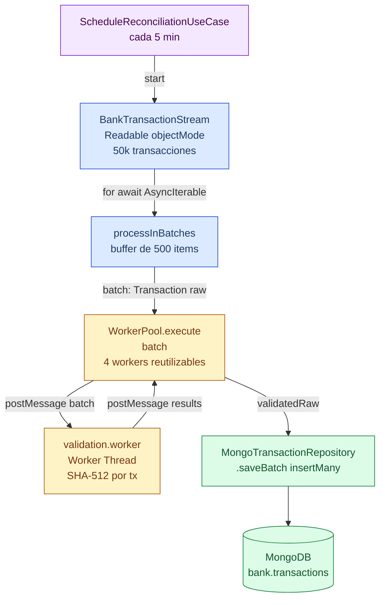

# 08-Project — Sistema de Conciliación Bancaria Automática

Proyecto integrador del learning path de Node.js. Aplica en un sistema real todos los conceptos estudiados en los módulos anteriores: **Event Loop**, **Streams + Backpressure**, **Memory/GC** y **Worker Threads**.

Arquitectura modular profesional (sin framework — puro Node.js + TypeScript).

---

## ¿Qué hace el sistema?

Simula la conciliación bancaria automática de 50.000 transacciones:

1. **Genera** un `Readable` stream de transacciones bancarias (simula una API o archivo grande).
2. **Agrupa** en batches de 500 usando un procesador por streaming — sin cargar todo en memoria.
3. **Valida criptográficamente** cada batch (SHA-512 por transacción) en Worker Threads — sin bloquear el Event Loop.
4. **Persiste** los batches validados en MongoDB.
5. **Programa** el proceso para correr cada 5 minutos usando un scheduler sin `setInterval` fijo (auto-ajusta al tiempo de procesamiento).

---

## Arquitectura

```
08-project/
├── index.ts                          ← entry point
└── src/
    ├── app/
    │   └── bootstrap.ts              ← conecta Mongo, arranca el módulo
    ├── modules/
    │   └── reconciliation/
    │       ├── reconciliation.module.ts   ← composición de Use Cases e infra
    │       ├── domain/
    │       │   ├── transaction.entity.ts  ← Transaction (id, amount, hash...)
    │       │   └── transaction.repository.ts ← interfaz del repositorio
    │       ├── application/
    │       │   ├── run-reconciliation.usecase.ts      ← orquesta stream→batch→worker→mongo
    │       │   └── schedule-reconciliation.usecase.ts ← scheduler auto-ajustado
    │       └── infraestructure/
    │           ├── bank-transaction.stream.ts  ← Readable de 50k transacciones
    │           ├── batch.processor.ts          ← agrupa con for-await sin cargar todo
    │           ├── mongo-transaction.repository.ts ← implementación MongoDB
    │           └── worker/
    │               ├── validation.worker.ts    ← Worker: SHA-512 por transacción
    │               └── worker.pool.ts          ← pool de 4 workers reutilizables
    └── shared/
        └── infraestructure/
            ├── logger.ts             ← logger JSON estructurado
            └── mongo.client.ts       ← singleton de conexión Mongo
```

---

## Capas (Domain-Driven Design lite)

| Capa | Responsabilidad | Depende de |
|---|---|---|
| **Domain** | Entidades y contratos (`Transaction`, `TransactionRepository`) | Nada |
| **Application** | Casos de uso, orquestación, reglas de negocio | Domain |
| **Infraestructure** | Implementaciones concretas: Mongo, Streams, Workers | Domain + Application |
| **App** | Bootstrap: conectar servicios y arrancar | Todo |

> La `Application` nunca importa nada de `Infraestructure`. La composición ocurre en `reconciliation.module.ts`.

---

## Flujo de datos



---

## Conceptos aplicados por archivo

### `bank-transaction.stream.ts` — Streams con Backpressure

```ts
return new Readable({
  objectMode: true,
  highWaterMark: 100,   // ← máximo 100 objetos en el buffer interno
  read() { this.push({ id, amount, timestamp }); }
});
```

- `objectMode: true` → el stream trabaja con objetos JS, no Buffers.
- `highWaterMark: 100` → backpressure: si el consumidor es lento, el `_read()` no se llama más.
- Simula una fuente **push infinita** (podría ser un WebSocket o API paginada).

---

### `batch.processor.ts` — Procesamiento sin acumular en memoria

```ts
for await (const item of source) {
  buffer.push(item);
  if (buffer.length >= batchSize) {
    await handler(buffer);   // procesa y libera antes del siguiente lote
    buffer = [];             // ← GC puede reclamar el batch anterior
  }
}
```

- Usa `for await` sobre el `Readable` (que implementa `AsyncIterable`).
- Nunca carga las 50.000 transacciones en memoria — sólo `batchSize` a la vez.
- El `await handler(buffer)` aplica **backpressure manual**: no pide más datos hasta terminar el batch.

---

### `worker.pool.ts` — Worker Pool reutilizable

```ts
// 4 workers arrancan una vez y procesan N batches
const pool = new WorkerPool(4);
await pool.execute(batch);  // toma un worker libre, ejecuta, lo devuelve al pool
```

- Sin pool: crear un Worker nuevo por batch costaría ~50–200ms de startup × 100 batches = overhead enorme.
- Con pool: los 4 workers arrancan una vez, cada `execute()` reutiliza el primero disponible.
- Los listeners `message`/`error` se limpian mutuamente para evitar acumulación en workers reutilizados.

---

### `validation.worker.ts` — CPU-bound en Worker Thread

```ts
parentPort?.on('message', (batch: any[]) => {
  const result = batch.map(tx => ({
    ...tx,
    hash: crypto.createHash('sha512').update(JSON.stringify(tx)).digest('hex'),
  }));
  parentPort?.postMessage(result);
});
```

- SHA-512 × 500 transacciones es trabajo CPU intensivo — bloquearía el Event Loop si corriera en el hilo principal.
- Al ejecutar en Worker Thread, el hilo principal sigue libre para conectar Mongo, responder health-checks, etc.

---

### `schedule-reconciliation.usecase.ts` — Scheduler sin drift

```ts
const schedule = async () => {
  const start = Date.now();
  await this.runUseCase.execute();             // puede tardar segundos
  const duration = Date.now() - start;
  const nextDelay = Math.max(0, interval - duration);  // resta el tiempo ya consumido
  setTimeout(schedule, nextDelay);
};
```

- `setInterval` fijo acumula ejecuciones si el proceso tarda más que el intervalo.
- Este patrón respeta el tiempo **entre ejecuciones** (si procesar tardó 3 min, espera 2 min más, no 5).

---

## Cómo ejecutar

```bash
# Requiere MongoDB corriendo localmente
mongod --dbpath /tmp/mongo

# Desde la raíz del monorepo (node/)
npm install

# Arrancar el sistema
npm run start
```

El logger imprime en JSON estructurado:

```json
{"level":"info","message":"Sistema iniciado","time":1771972860308}
```

---

## Decisiones de diseño

| Problema | Solución aplicada | Por qué |
|---|---|---|
| 50k transacciones en memoria | `Readable` + `for await` + batches | Heap constante, no crece con el volumen |
| SHA-512 bloquea Event Loop | `WorkerPool` de 4 workers | CPU-bound → Worker Thread |
| Startup overhead de Workers | Pool persistente (no crea/destruye) | Un worker nuevo cuesta ~100ms |
| Scheduler con drift | `setTimeout` auto-ajustado | `setInterval` acumula ejecuciones tardías |
| Singleton MongoDB | Módulo con estado (`let client`) | Una sola conexión compartida en el proceso |
| Workers con ts-node | Eval pattern: `require('ts-node').register(...)` | Los Workers no heredan el registro de ts-node del padre |

---

## Checklist de conceptos integrados

- [x] **Event Loop** — el hilo principal nunca se bloquea; toda la CPU va a Workers.
- [x] **Streams** — `Readable` con `highWaterMark`, backpressure implícito via `for await`.
- [x] **Memory/GC** — buffer liberado después de cada batch; no hay referencias retenidas.
- [x] **Worker Threads** — pool de 4 workers para trabajo CPU-bound.
- [x] **Arquitectura modular** — Domain / Application / Infraestructure bien separadas.
- [x] **CommonJS** — `"type": "commonjs"` para compatibilidad con ts-node y Workers.
